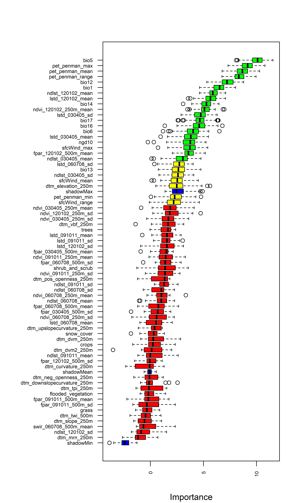
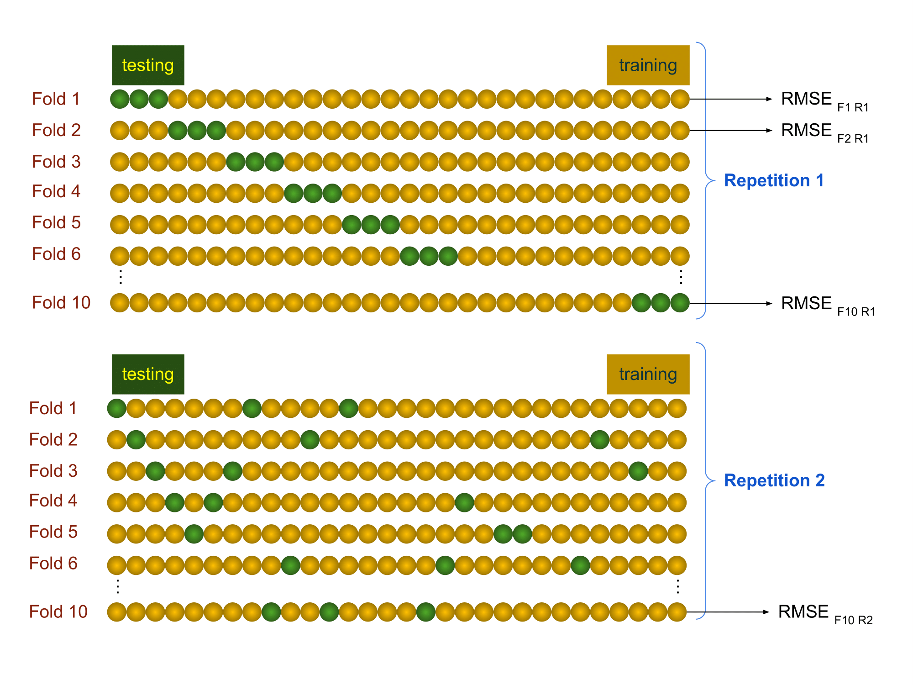

# Step 3: Mapping continuous soil properties

In this chapter, the cleaned soil data and the previously downloaded covariate layers are used to generate soil property maps using DSM techniques. These consist of merging soil and environmental covariates data, selecting the covariates, calibrating the machine learning model, assessing the uncertainty, predicting the soil properties and finally export the maps.

## Mapping Soil Properties with Random Forest

Random Forest is a popular machine learning algorithm used in Digital Soil Mapping (DSM) for predicting the distribution of continuous soil properties. It leverages an ensemble of decision trees to improve the accuracy of predictions for the expected value of the target soil parameters.

In Random Forest, multiple individual decision trees are created, each trained on a random subset of the available data. These trees make independent predictions, and the final prediction is obtained by aggregating the predictions of all the trees. This ensemble approach helps to reduce the risk of overfitting and improves the model's generalization ability. Furthermore, Random Forest introduces an additional level of randomness by selecting different subsets of covariates (features) at each node of the trees. This feature sampling increases the independence between trees and helps mitigate potential collinearity issues in the individual regression tree models.

By combining the predictions of multiple trees and incorporating randomness in feature selection, Random Forest provides robust and reliable predictions for soil properties in DSM applications.

The main limitation of Random Forest is that it focuses primarily on predicting the mean value of the target variable thus it does not provide direct information about the variability or distribution of the target variable's predictions. This limits the possibility of  assessment of the uncertainty of the predictions.

Quantile regression forests (QRF, @Meinshausen2006) are a generalisation of the random forest models, capable of not only predicting the conditional mean, but also the conditional probability density function. This provides a more comprehensive understanding of the full conditional distribution of the predictions, capturing the uncertainty and dispersion associated with different quantiles or levels of the target variable. This feature allows one to estimate the standard deviation of the prediction, as well as the likelihood of the target variable falling below a given threshold. By considering the dispersion of the predictions, QRF enables us to assess the model uncertainty and make more informed decisions. In a context where a minimum level of a soil nutrient concentration may be decisive for improving the crop yield, this feature can play an important role for the GSNmap initiative. Model calibration will be implemented using the caret package [@Kuhn2022]. While we suggest to use QRF, caret provides a large set of models https://topepo.github.io/caret/available- models.html#) that might perform better in specific cases. In this regard, it is up to the user to implement a different model, ensuring the product specifications (Section Product Specifications).

We demonstrate the implementation of Quantile Regression Forest (QRF) for modeling and mapping soil properties and its associated uncertainty. The implementation presented here utilizes the Boruta, ranger, caret, and terra R packages.

## Getting prepared to map

To begin, we open *RStudio* and empty our global environment. Then, we set the working directory and assign the file path to our AOI shapefile to an R object. The target soil property that is going to be mapped in this exercise is Potassium denoted as 'k' in the soil data table. Next, an R function that was built by the GSP is loaded from the training material folder. Finally, the packages that are going to be needed for mapping are called. 

```{r, eval = F, message = F, warning = F}

#_______________________________________________________________________________
#
# Quantile Regression Forest
# Soil Property Mapping
#
# GSP-Secretariat
# Contributors: Isabel Luotto (GSP-FAO)
#               Marcos E. Angelini (GSP-FAO)
#               Luis Rodríguez Lado (GSP-FAO)
#               Stephen Roecker (NRCS-USDA)
#_______________________________________________________________________________

#Empty environment and cache 
rm(list = ls())
gc()

# Content of this script =======================================================
# 0 - Set working directory, soil attribute, and packages
# 1 - Merge soil data with environmental covariates 
# 2 - Covariate selection
# 3 - Model calibration
# 4 - Uncertainty assessment
# 5 - Prediction
# 6 - Export final maps
#_______________________________________________________________________________


# 0 - Set working directory, soil attribute, and packages ======================

# Working directory
setwd(dirname(rstudioapi::getActiveDocumentContext()$path))
setwd("..")

# Define country of interes throuhg 3-digit ISO code
ISO ='ISO'

# Load Area of interest (shp)
AOI <- '01-Data/AOI.shp'

# Terget soil attribute (Mandatory 10)
soilatt<- "soc_0_30" 

# Function for Uncertainty Assessment
load(file = "03-Scripts/eval.RData")

#load packages
library(tidyverse)
library(caret)
library(terra)
library(Boruta)
library(ranger)

```


Since soil data and environmental covariates are stored in different files and formats, it is necessary to first merge them into one dataframe. For this purpose, the covariate raster file is loaded into **R** from the covariates folder. Secondly, the table with the cleaned and quality checked soil data is loaded and converted to a shapefile using the lat/long coordinates columns.

```{r, eval = F, message = F, warning = F}
# 1 - Merge soil data with environmental covariates ============================

## 1.1 - Load covariates -------------------------------------------------------
covs <- rast("01-Data/covs/Covariates.tif") # match case of the file name
ncovs <- names(covs)

## 1.2 - Load the soil data (Script 2) -----------------------------------------
dat <- read_csv("02-Outputs/harmonized_soil_data.csv")

# Convert soil data into a spatial object (check https://epsg.io/6204)
dat <- vect(dat, geom=c("x", "y"), crs = crs(covs))

```

The shapefile can be reprojected to match the CRS of the covariates using the project function of the terra package. 

```{r, eval = F}
# Reproject point coordinates to match coordinate system of covariates
dat <- terra::project(dat, covs)
names(dat) 
```

Afterwards, the extract function can be used to extract the values of each covariate raster layer at the point location of each soil profile. This data is then merged in the dat dataframe. After checking the descriptive statistics of dat with the `summary()` command, the target soil attribute is selected together with the covariates. Finally, NA values (empty row values) are removed using the `na.omit()` function.

```{r, eval = F}
## 1.3 - Extract values from covariates to the soil points ---------------------
pv <- terra::extract(x = covs, y = dat, xy=F)
dat <- cbind(dat,pv)
dat <- as.data.frame(dat)

summary(dat)
```

## Covariate selection

In a high-dimensional datasets, not all available features are equally informative for training a model. By detecting and subsetting the only relevant features for modeling, we can improve model's predictive performance, reduce its complexity, speeds up computations and enhance interpretability, allowing us to gain deeper insights into the underlying relationships within the data. Feature selection serves this purpose by identifying and retaining only those relevant features that are uncorrelated and non-redundant in the prediction of a target soil parameter, resulting in a more focused and effective model that is capable of making more accurate predictions.
Feature selection was implemented through the Boruta package [@miron2010], a feature selection algorithm that aims to identify the most relevant features in a dataset in both classification and regression problems. The algorithm is specifically designed for dealing with high-dimensional datasets and works by comparing the importance of each covariate against a randomized version of itself, known as shadow feature, that serve as a reference to determine whether the covariate has a higher importance than expected by chance.
The algorithm goes through a series of iterations, where it progressively eliminates irrelevant features. In each iteration, it evaluates the importance of each feature based on the random forest model and compares it to the importance of the corresponding shadow feature. If a feature's importance is significantly higher than its shadow, it is considered relevant and retained. Otherwise, it is deemed uninformative and removed. The iterations continue until all features are either confirmed as relevant or identified as uninformative. The final outcome is a set of relevant features (covariates) that are statistically significant in terms of their importance for explaining the target variable, thus reducing data dimensionality for improved model performance and interpretability.
The feature importance can be displayed in a graph showing different colors according to the importance of each feature in the model, with ‘green’, ‘yellow’, ‘red’ and ‘blue’ colors for ‘confirmed’, ‘tentative’, ‘rejected’ and ‘shadow’ features respectively (see \@ref(fig:borutaplot)). Only those marked in green color are retained as valuable predictors.

```{r, eval = F}
  # 2 - Covariate selection with Boruta package ==================================
  # Wrapper feature selection algorithm
  ## 2.1 - Run the Boruta algorithm ----------------------------------------------
  fs_bor <- Boruta(y = d[,soilatt], x = d[-1], maxRuns = 100, doTrace = 1)
  
  ## 2.2 - Plot variable importance and selected features ------------------------
  png(filename = paste0("02-Outputs/importance_",soilatt,".png"), 
       width = 15, height = 25, units = "cm", res = 600)
  par(las = 2, mar = c(4, 10, 4, 2) + 0.1)
  Boruta:::plot.Boruta(fs_bor, horizontal = TRUE, ylab = "",
                       xlab = "Importance", cex.axis=0.60)
  dev.off()
  ## 2.3 - Extract the selected feature variables --------------------------------
  (fs_vars <- getSelectedAttributes(fs_bor, withTentative = TRUE))

```

The selected covariates can be visualised in Trellis displays. Finally, the optimal predictors are stored in a dedicated R object.

```{r, eval = T, echo = F, message = F, warning = F}
soilatt <- "n_0_30"
```

```{r borutaplot, echo = FALSE, fig.cap = "Covariates selecction for Total Nitrogen using Boruta algorithm."}

```


## Model calibration

The QRF model is calibrated using only the previous selection of covariates that actually have shown an effect on the target soil property. This is an important step to avoid overfitting of the model that can hamper a model's capacity to predict. Calibration is done by the  'train' function from the caret package, utilizing the implementation of the random forest algorithm provided by the ranger package. During the model training, several important hyperparameters need to be set. These hyperparameters include:

* 'mtry': This parameter determines the number of subset predictors considered for each split in the regression trees. It controls the level of randomness and feature diversity in the tree-building process.

* 'splitrule': This parameter specifies the criterion used to evaluate the quality of a potential split at each node of the tree. For regression problems, it is often set to "variance," which measures the reduction in variance of the target variable achieved by splitting at a particular node. In our implementation, we consider three possible criteria: "variance," "extratrees," and "maxstat." We select the criterion that produces the best calibrated model.

* 'min.node.size': This parameter represents the minimum number of observations (samples) required to create a terminal (leaf) node in a decision tree within the random forest algorithm. It ensures that each leaf contains a minimum number of observations to prevent overfitting and improve the generalization ability of the model. In regression problems, this number is typically set to 5.

Additionally, certain control parameters are necessary for training the model. These parameters are defined in the trainControl function and relate to the resampling method used to construct the bootstrap datasets. In our case, the resampling method is set to 'repeatedcv,' with 10-fold cross-validation and 10 repetitions.

As cross-validation plays a crucial role in the model calibration step, we explain the process in detail at this stage. Cross-validation is a widely used method in Digital Soil Mapping (DSM) to assess the overall accuracy of the resulting maps. It involves randomly dividing the input data into a training set and a testing set. However, relying on a single testing dataset can introduce bias in the overall accuracy estimation. To mitigate this bias, we employ k-fold cross-validation. In this approach, the data is randomly partitioned into k parts, with one part used for testing and the remaining k-1 parts used for training the model. This process is repeated multiple times to enhance the robustness of parameter estimations. The final approach we adopt is known as repeated k-fold cross-validation, with k set to ten in this specific process. To help visualize the 10-fold cross-validation process, refer to Figure \@ref(fig:cv). Each row in the figure represents a step where the data is split into 10 subsets, with some samples marked as green balls representing the testing set, and others as yellow balls representing the training set. The figure illustrates how the data is divided into subsets in each step of the 10-fold process, and the blocks represent the repetition steps.
By employing repeated k-fold cross-validation, we can obtain a comprehensive assessment of the model's performance, ensuring reliable and robust parameter estimations for the final model.


```{r cv, echo = FALSE, fig.cap = "Schematic representation of the repeated cross-validation process."}

```

Repeated cross validation has been nicely implemented in the caret R package [@Kuhn2022], along with several calibration methods. Here, we use the `Boruta()` function to specify the modalities of the cross-validation that contain the abovementioned settings. These settings are stored in an object called "fitControl". Next, the user has to specify a formula that will be used in a regression. In line with the purpose of mapping the target soil property, the formula has Potassium as target variable (dependent variable) and all covariates as independent or explanatory variables.


```{r, eval = F}
  # 3 - QRF Model calibration with ranger ========================================
  ## 3.1 - Set training parameters -----------------------------------------------
  fitControl <- trainControl(method = "repeatedcv",
                             number = 10,         ## 10 -fold CV
                             repeats = 10,        ## repeated 10 times
                             savePredictions = TRUE)
  
  ## 3.2 - Tune hyperparameters --------------------------------------------------
  mtry <- round(length(fs_vars)/3)
  tuneGrid <-  expand.grid(
    mtry = abs(c(mtry-round(mtry/2),
                 mtry-round(mtry/3), 
                 mtry, 
                 mtry+round(mtry/3),
                 mtry+round(mtry/2))),
    min.node.size = 5,
    splitrule = c("variance", "extratrees", "maxstat")
  )
  
  ## 3.3 - Calibrate the ranger model --------------------------------------------
  print(soilatt)
  print("training the model...")
  model_rn <- caret::train(
    y = d[, soilatt], x = d[,fs_vars],
    method = "ranger",
    quantreg = TRUE,
    importance = "permutation",
    trControl = fitControl,
    verbose = TRUE,
    tuneGrid = tuneGrid
  )
  print(model_rn)
  print(model_rn$bestTune)

```


The results have been stored in an R object called model_rn. To assess the contribution of each covariate on the model prediction. Finally, the model output is saved in the model folder within the Outputs folder - specifying the target soil properties. 


## Uncertainty assessment
Accuracy assessment is an essential step in digital soil mapping. One aspect of the accuracy assessment has been done in Step 7 by predicting the standard deviation of the prediction, which shows the spatial pattern of the uncertainty. Another aspect of the uncertainty is the estimation of the overall accuracy to measure the model performance. This will be measured using the model residuals generated by caret during the repeated cross validation step.
The residuals produced by caret consist of tabular data with observed and predicted values of the target soil property. They can be used to estimate different accuracy statistics. @Wadoux2022 have reviewed and evaluated many of them. While they concluded that there is not a single accuracy statistic that can explain all aspect of map quality, they recommended the following:

The average error indices all relate to the difference between observed (z) and predicted (&#7825;) value of soil property *S* at the location *i*. The error $\epsilon$ is thus defined as:
\begin{equation}
\epsilon(S_{i}) = z(S_{i}) - \hat{z}(S_{i})
\end{equation}

The error indices that can be derived from this calculation inform about different aspects of prediction error and have the same unit as the target soil property. The mean prediction error (ME) estimates the prediction bias (see Eq. \@ref(eq:me)). If the ME is negative it means that the predicted values are below the observed ones. Conversely, a positive ME indicates a bias of the model towards higher predictions.

\begin{equation} 
  ME = \frac{1}{N}\sum_{i=1}^{N}\epsilon(S_{i})
  (\#eq:me)
\end{equation}

Mean absolute error (MAE) and root-mean squared error (RMSE) estimate the magnitude of errors. The MAE takes the absolute value of the ME thus quantifies the overall magnitude of the prediction error (see Eq.\@ref(eq:mae)). The closer the MAE is to 0 the more accurate is the model prediction.

\begin{equation} 
  MAE = \frac{1}{N}\sum_{i=1}^{N}|\epsilon(S_{i})|
  (\#eq:mae)
\end{equation}

Also, the RMSE provides a measure of the prediction error. Ideally, the RMSE approximates 0. Due to the squaring, larger absolute errors become more important (see Eq. \@ref(eq:rmse)). Thus, high absolute errors may lead to a worse RMSE measure. Therefore, it is best to calculate all three error indices to get a comprehensive picture.

\begin{equation} 
  RMSE = \sqrt{\frac{1}{N}\sum_{i=1}^{N}\epsilon(S_{i})^{2}}
  (\#eq:rmse)
\end{equation}

Besides the error indices, model quality can also be expressed by the coefficient of determination (R^2^) which is the squared Pearson's product-moment correlation coefficient (r) (see Eq. \@ref(eq:r2)). The R^2^ takes values between 0 and 1. An R^2^ of 1 indicates total correlation between predicted and observed values whereas 0 indicates no correlation. The R^2^ can be biased by several factors and thus needs to be combined with other measures to yield a complete picture [@Wadoux2022]. 

\begin{equation} 
  r^2 = \frac{\sum_{i=1}^{N}(z(S_{i})-\overline{z})(\hat{z}(S_{i})-\overline{z})}{\sqrt{\sum_{i=1}^{N}(z(S_{i})-\overline{z})^2}\sqrt{\hat{z}(S_{i})-\overline{\hat{z}})^2}}
  (\#eq:r2)
\end{equation}

The Pearson's product-moment correlation coefficient (r) can take values between -1 and 1 and thus indicate the direction of the correlation (see Eq. \@ref(eq:r)).

\begin{equation} 
  r = \frac{\sum_{i=1}^{N}(z(S_{i})-\overline{z})(\hat{z}(S_{i})-\overline{z})}{\sqrt{\sum_{i=1}^{N}(z(S_{i})-\overline{z})^2}\sqrt{\hat{z}(S_{i})-\overline{\hat{z}})^2}}
  (\#eq:r)
\end{equation}

The modelling efficiency coefficient (MEC) accounts for the proportion of variance that is explained by a model [@Janssen1995]. It is calculated as the ratio of the RMSE and the variance (squared standard deviation) (see Eq. \@ref(eq:mec)). In a perfect scenario, the MEC equals 1. If the MEC equals 0, it means that the model does not predict the values better than the mean of the observed values would. In addition to that, the MEC can also take negative values if the RMSE is greater than the variance. In consequence, negative MECs indicate that the model predicts the values worse than the mean of the observed values.

\begin{equation} 
  MEC = 1 - \frac{\sum_{i=1}^{N}(z(S_{i})-\hat{z}(S_{i}))^2}{\sum_{i=1}^{N}(z(S_{i})-\overline{z})^2}
  (\#eq:mec)
\end{equation}

The R^2, RMSE, and the MEC are susceptible to bias through large error values. Thus, caution needs to be taken when interpreting the indices presented here for accuracy assessment.

Now, back to the mapping exercise: In practical terms, before calculating any of these indices, it is necessary to first extract observed and predicted values and then store them in two separate R objects. Next, both values are combined to a dataframe.


```{r, eval = T, message = F, warning = F}
  # 4 - Accuracy assessment ======================================================
  ## 4.1 - extract observed and predicted values ---------------------------------
model_rn <- readRDS('Digital-Soil-Mapping/02-Outputs/models/ranger_model_soc_0_30.rds')

  o <- model_rn$pred %>% 
    filter(mtry == model_rn$bestTune$mtry, 
           splitrule==model_rn$bestTune$splitrule, 
           min.node.size==model_rn$bestTune$min.node.size) %>% 
    select(obs) %>% as.vector() %>% unlist()
  p <- model_rn$pred %>% 
    filter(mtry == model_rn$bestTune$mtry, 
           splitrule==model_rn$bestTune$splitrule, 
           min.node.size==model_rn$bestTune$min.node.size) %>% 
    select(pred) %>% as.vector() %>% unlist()
  df <- data.frame(o,p)
```

While solar diagrams [@Wadoux2022] are desired, we propose to produce a scatterplot of the observed vs predicted values maintaining the same range and scale for the X and Y axes. The dataframe is used for this purpose to plot observed values on the x-axis and predicted values on the y-axis.

```{r, eval = T, message = F}
  ## 4.2 - Plot and save scatterplot --------------------------------------------- 
  (g1 <- ggplot(df, aes(x = o, y = p)) + 
     geom_point(alpha = 0.3) + 
     geom_abline(slope = 1, intercept = 0, color = "red")+
     ylim(c(min(o), max(o))) + theme(aspect.ratio=1)+ 
     labs(title = soilatt) + 
     xlab("Observed") + ylab("Predicted"))
  # ggsave(g1, filename = paste0("02-Outputs/residuals_",soilatt,".png"), scale = 1,
  #        units = "cm", width = 12, height = 12)
```


Additionally, it is necessary to calculate standard metrics of error estimation. The function eval() below returns values for the ME, RMSE, MAE, the squared pearson correlation coefficient, the concordance correlation coefficient, scale shift and location shift relative to scale.

```{r include=FALSE}
load(file = "Digital-Soil-Mapping/03-Scripts/eval.RData")
  o <- model_rn$pred %>% 
    filter(mtry == model_rn$bestTune$mtry, 
           splitrule==model_rn$bestTune$splitrule, 
           min.node.size==model_rn$bestTune$min.node.size) %>% 
    select(obs) %>% as.vector() %>% unlist()
  p <- model_rn$pred %>% 
    filter(mtry == model_rn$bestTune$mtry, 
           splitrule==model_rn$bestTune$splitrule, 
           min.node.size==model_rn$bestTune$min.node.size) %>% 
    select(pred) %>% as.vector() %>% unlist()
  df <- data.frame(o,p)
```

```{r echo=TRUE}
## 4.2 - Print accuracy coeficients --------------------------------------------
# https://github.com/AlexandreWadoux/MapQualityEvaluation
print(eval(df$p,df$o))
```
```{r, echo = FALSE, message=F, warning=F}

library(dplyr)
library(kableExtra)
dt <- read.csv("tables/eval.csv", sep = ",")
kable(booktabs = T, dt, col.names = gsub("[.]", " ", names(dt)), caption = 'Accuracy statistics.') %>%
kable_classic(full_width = F)
```

Finally, note that accuracy assessment has been discussed in @Wadoux2021, since the spatial distribution of soil samples might constrain the validity of the accuracy statistics. This is especially true in cases where the spatial distribution of observations is clustered. The authors recommended creating a kriging map of residuals before using them for assessing the map quality.

## Predicting soil attributes

After calibrating the model, caret will select the best set of parameters and will fit the model using the whole dataset. Then, the final model can be used to predict the target soil properties. The process uses the model and the values of the covariates at target locations. This is generally done by using the same input covariates as a multilayer raster format, ensuring that the names of the layers are the same as the covariates in the calibration dataset. In this step we will predict the conditional mean and conditional standard deviation at each raster cell.

To prevent for potential computational power limitations, first the raster is split into so-called tiles that divide the whole area of interest in multiple rasters with a coarse resolution. In this case 25 tiles are produced (5 rows x 5 columns). The functions for tiling come from the terra package. The predictions can also be hadled at one time by setting the parameters 'nrows' and 'ncols' in the 't' object to 1.


```{r, eval = F}
  # 5 - Prediction ===============================================================
  # Generation of maps (prediction of soil attributes) 
  ## 5.1 - Produce tiles ---------------------------------------------------------
  # r <-covs[[1]]
  # t <- rast(nrows = 5, ncols = 5, extent = ext(r), crs = crs(r))
  # tile <- makeTiles(r, t,overwrite=TRUE,filename="02-Outputs/tiles/tiles.tif")


```

Next, a for loop is formulated to predict each soil attribute for each tile. The tiling significantly improves the computational speed of the prediction. For each tile the mean and the standard deviation are stored in two separated objects that are then saved as raster files.

```{r, eval = F}
  ## 5.2 - Predict soil attributes per tiles -------------------------------------
  # loop to predict soilatt on each tile
  
    for (j in seq_along(tile)) {
    gc()
    # read the tile
    t <- rast(tile[j])
    # crop the selected covariates with the tile j
    covst <- crop(covs[[fs_vars]], t)
    
    # create a function to extract the predited values from ranger::predict.ranger()
    pfun <- \(...) { predict(...)$predictions |> t() }
    
    # predict conditional standard deviation
    terra::interpolate(covst, 
                       model = model_rn$finalModel, 
                       fun=pfun, 
                       na.rm=TRUE, 
                       type = "quantiles", 
                       what=sd,
                       filename = paste0("02-Outputs/tiles/soilatt_tiles/",
                                         soilatt,"_tileSD_", j, ".tif"), 
                       overwrite = TRUE)
    
    # predict conditional mean
    terra::interpolate(covst, 
                       model = model_rn$finalModel, 
                       fun=pfun, 
                       na.rm=TRUE, 
                       type = "quantiles", 
                       what=mean,
                       filename = paste0("02-Outputs/tiles/soilatt_tiles/",
                                         soilatt,"_tile_", j, ".tif"), 
                       overwrite = TRUE)
    
    print(paste("tile", j, "of", length(tile)))
  }
```

As a result, 25 tiles for the predicted mean and 25 tiles for the predicted standard deviation were produced using the QRF model. The next step is to merge these tiles to produce a map of the predicted mean and one of the predicted standard deviation. For this, again for loops are employed that read all raster file tiles. These are then put together by the mosaic() function of the terra package. Finally, they are masked to the AOI and then can be visualised in a figure.

```{r, eval = F}
  ## 5.3 - Merge tiles both prediction and st.Dev --------------------------------
  f_mean <- list.files(path = "02-Outputs/tiles/soilatt_tiles/", 
                       pattern = paste0(soilatt,"_tile_"), full.names = TRUE)
  f_sd <- list.files(path = "02-Outputs/tiles/soilatt_tiles/", 
                     pattern =  paste0(soilatt,"_tileSD_"), full.names = TRUE)
  r_mean_l <- list()
  r_sd_l <- list()
  
  for (g in 1:length(f_mean)){
    r <- rast(f_mean[g])
    r_mean_l[g] <-r
    rm(r)
  }
  
  for (g in 1:length(f_sd)){
    
    r <- rast(f_sd[g])
    r_sd_l[g] <-r
    rm(r)
  }
  r_mean <-sprc(r_mean_l)
  r_sd <-sprc(r_sd_l)
  
  pred_mean <- mosaic(r_mean)
  pred_sd <- mosaic(r_sd)
  
  aoi <- vect(AOI)
  pred_mean <- mask(pred_mean,aoi)
  pred_sd <- mask(pred_sd,aoi)
  
  
  plot(c(pred_mean, pred_sd), main = paste(c("mean","sd"), soilatt), 
       col = hcl.colors(100, "Viridis"))
```

```{r echo=FALSE, message=FALSE, warning=FALSE}
library(terra)
pred_mean <- rast("Digital-Soil-Mapping/02-Outputs/noMaskedMaps/mean_n_0_30.tif")
pred_sd <- rast("Digital-Soil-Mapping/02-Outputs/noMaskedMaps/sd_n_0_30.tif")
plot(c(pred_mean, pred_sd), main = paste(c("mean","sd"), soilatt), 
       col = hcl.colors(100, "Viridis"))
```


The final step then consists of applying a cropland mask that is applied to the map and the uncertainty map since the soil data comes only from croplands and thus no assumption can be made to soil property values under different land covers. Additionally, a map is calculated to visualise the coefficient of variation (in Percent). The maps are then stored as raster files (GeoTiff/.tif) in the Outputs folder. 


```{r, eval = F}
  # 6 - Export final maps ========================================================
  ## 6.1 - Mask croplands --------------------------------------------------------
  msk <- rast("01-Data/covs/mask.tif")
  # plot(msk)
  msk <- terra::project(msk, pred_mean)
  pred_mean <- mask(pred_mean, msk)
  # plot(pred_mean)
  pred_sd <- mask(pred_sd, msk)
  # plot(pred_sd)
  plot(pred_sd/pred_mean*100, main = paste("Coeficient of variation", soilatt), 
       col = hcl.colors(100, "Viridis"))
  
  ## 6.2 - Save results ----------------------------------------------------------
  writeRaster(pred_mean, 
              paste0("02-Outputs/maps/",ISO,"_GSNmap_mean_",soilatt, ".tif"),
              overwrite=TRUE)
  writeRaster(pred_sd, 
              paste0("02-Outputs/maps/",ISO,"_GSNmap_sd_",soilatt, ".tif"),
              overwrite=TRUE)
```


