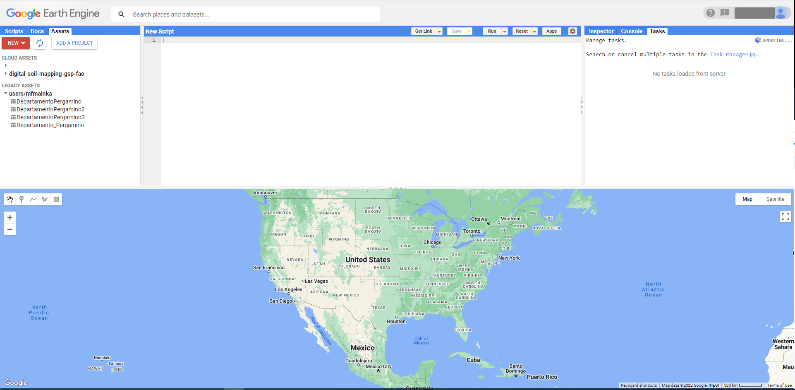
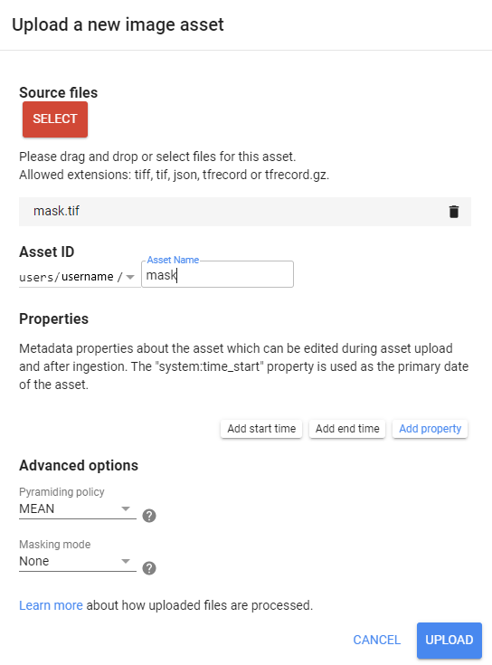
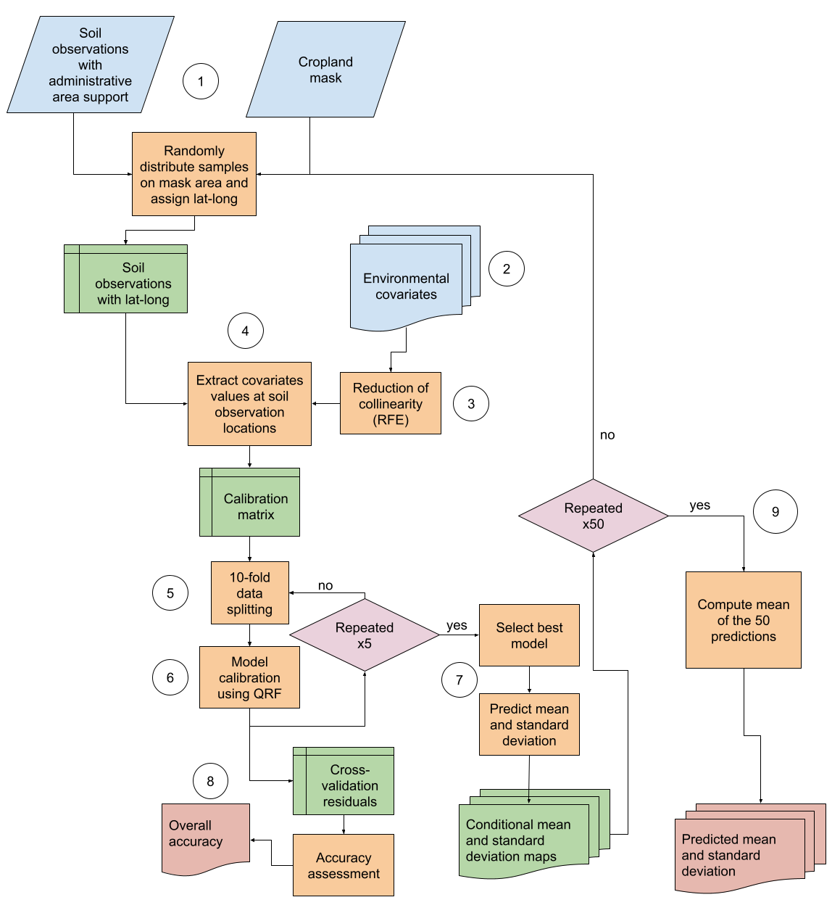

--- 
title: "Technical Manual for Global Soil Nutrient and Nutrient Budgets map (GSNmap)"
author: "FAO"
date: ""
site: bookdown::bookdown_site
output: 
  #bookdown::pdf_book:
  bookdown::gitbook:
    fig_caption: yes
header-includes:
    - \AtBeginDocument{\renewcommand{\chaptername}{Chapter}}
    - \usepackage{titling}
    - \usepackage{natbib}
    - \usepackage{pdfpages}
    - \usepackage{fancyhdr}
    - \usepackage{booktabs}
    - \usepackage{longtable}
    - \usepackage{subfig}
    - \usepackage{array}
    - \usepackage{amsmath}
    - \usepackage{multirow}
    - \usepackage{wrapfig}
    - \usepackage{bookmark}
    - \usepackage[utf8]{inputenc}
    - \usepackage{float}
    - \usepackage{colortbl}
    - \usepackage{pdflscape}
    - \usepackage{tabu}
    - \usepackage{threeparttable}
    - \usepackage{threeparttablex}
    - \usepackage[normalem]{ulem}
    - \usepackage{makecell}
    - \usepackage{xcolor}
    - \DeclareUnicodeCharacter{2212}{\textendash}
    - \usepackage{rotating, graphicx}
documentclass: book
csl: food-and-agriculture-organization-of-the-united-nations.csl
bibliography: "reference-list.bib"
link-citations: yes
classoption: oneside
papersize: b5
fontsize: 10pt
description: "GSNmap - Technical Manual"
always_allow_html: yes
template: null
---


```{r set-options, echo=FALSE, cache=FALSE, warning=FALSE, message=FALSE, eval = FALSE}
options(knitr.table.format = "latex")
options(width = 60)

library(kableExtra)
# Cache results
knitr::opts_chunk$set(cache=F,fig.pos = 'H',tidy.opts=list(width.cutoff=40),tidy=FALSE, size="tiny", fig.cap = T)

#reduce pdf file size
knitr::opts_chunk$set(dev = 'jpeg')

## redefine str for the width option
str <- function(...){
  utils::str(..., strict.width = "cut")}

addline_format <- function(x,...){
  gsub('\\s','\n',x)
}
underscore_to_space <- function(x,...){
  gsub("_", " ",x)
}


#bookdown::render_book("index.Rmd", "bookdown::gitbook")
#bookdown::clean_book(TRUE)
#bookdown::render_book("index.Rmd", "bookdown::pdf_book")
#bookdown::render_book("index.Rmd", "bookdown::word_document2")
```


\frontmatter
\addtocontents{toc}{\protect\hypersetup{hidelinks}}   
\addtocontents{lof}{\protect\hypersetup{hidelinks}}
\addtocontents{lot}{\protect\hypersetup{hidelinks}}
\tableofcontents
\listoffigures
\listoftables
\nopagebreak[4]

# Abbreviations and acronyms {-}
BD

:   Bulk density

CEC

:   Cation exchange capacity

CRAN

:   Comprehensive R archive network

DSM

:   Digital soil mapping 

GEE

:   Google Earth Engine

GSP

:   Global Soil Partnership

INSII

:   International Network of Soil Information Institutions

ITPS

:   Intergovernmental Technical Panel on Soils

ME

:   Mean error

MAE

:   Mean absolute error

MEC

:   Modelling efficiency coefficient

NDVI

:   Normalized difference in vegetation index

QA/QC

:   Quality assurance/quality check

RMSE

:   Root mean squared error

SOC

:   Soil organic carbon

SOM

:   Soil organic matter

# Editors {-}

*Prepared by:*\
**Global Soil Partnership Secretariat**\
Ronald Vargas\

# Contributors and reviewers {-}

**International Network of Soil Information Institutions**\

**GSNmap working group**

**Third Intergovernmental Technical Panel on Soils**\
Rosa Poch - Spain (*Chair*); Nsalambi V. Nkongolo - Democratic Republic
of the Congo; 

<!--chapter:end:index.Rmd-->

\mainmatter


# Presentation

##	Background and objectives
Soil nutrient availability can affect ecosystem carbon cycling, plant phenology, plant diversity and community composition, plant-herbivore and plant-soil-microbe interactions, as well as the structure of trophic food webs (van Sundert et al., 2020). Thus, the broad range of effects of nutrient availability also affects ecosystem functioning in face of global change, for instance the response of plants to elevated levels of CO~2~ (Vicca et al., 2018). 

In the context of agriculture, nutrient availability modulates crop productivity and thus food production. However, the COVID-19 pandemic, current conflicts and devastating extreme weather events triggered by climate change jeopardise achieving sustainable development goal (SDG) 2 (Zero Hunger) by 2030. To date, a total number of around 2.3 billion people are affected by moderate and severe food insecurity (FAO et al., 2022). Despite soil nutrient status and availability being vital to the provisioning of ecosystem services, globally-accessible and harmonised datasets on soil nutrient stocks and soil properties that govern nutrient availability are missing. 

Therefore, the current global situation requires an increase of food production while preserving natural (soil) resources, lowering greenhouse gas emissions and optimising the use of goods such as fertilisers on agricultural sites (Eisenstein, 2020). Fertiliser prices more than doubled within one year and grain prices increased by around 25 percent (Jan. 2021 - Jan. 2022) (Hebebrand and Laborde, 2022). With the start of the armed conflict in Ukraine in February 2022, this trend became more pronounced.
Growing food insecurity and rapidly increasing fertiliser prices underscore the urgent need for informed decision-making and optimised soil nutrient management. However, a large data gap exists in regards to soil nutrient stocks and soil properties that govern nutrient availability. Therefore, FAO’s Global Soil Partnership (GSP) has launched the Global Soil Nutrient and Nutrient Budget map (GSNmap) initiative in an endeavour to provide harmonised and finely resolved soil nutrient data and information to stakeholders following a country-driven approach.
Up-to-date soil data on the status and spatial trends of soil nutrients and related soil attributes is key to guide policy-making to close yield gaps, and protect local natural resources. Therefore, locally-specific optimisation of soil nutrient and agricultural management are needed (Cunningham et al., 2013). The soil information collected in the GSNmap thereby serves as a cornerstone in delineating priority areas for action and thereby seizes the opportunity to reduce food insecurity, close yield gaps, and reduce environmental costs arising from mismanagement of soil nutrients and especially overfertilisation.


## Global Soil Partnership
The Global Soil Partnership (GSP) was established in December 2012 as a mechanism to develop a strong interactive partnership and to enhance collaboration and generate synergies between all stakeholders to raise awareness and protect the world’s soil resources. From land users to policymakers, one of the main objectives of GSP is to improve governance and promote sustainable management of soils. Since its creation, GSP has become an important partnership platform where global soil issues are discussed and addressed by multiple stakeholders at different levels. 

The mandate of GSP is to improve governance of the planet’s limited soil resources in order to guarantee productive agricultural soils for a food-secure world. In addition, it supports other essential soil ecosystem services in accordance with the sovereign right of each Member State over its natural resources. In order to achieve its mandate, GSP addresses six thematic action areas  to be implemented in collaboration with its regional soil partnerships (Figure 1).

The area of work on Soil Information and Data (SID) of the GSP builds an enduring and authoritative global system (GloSIS) to monitor and forecast the condition of the Earth's soil resources and produce map products at the global level. The secretariat is working with the  international network of soil data providers (INSII - International Network of Soil Information Institutions) to implement data related activities. 

## Country-driven approach and tasks

The GSNmap initiative will be jointly implemented by the International Network of Soil Information Institutions (INSII) and the GSP Secretariat. The process will be country-driven, involving and supporting all Member States in developing their national GSNmap data products. The GSNmap products will be developed following a two phase approach:

* Phase I: development of soil nutrient and associated soil property maps;
* Phase II: quantification, analysis, projections of nutrient budgets for agricultural land use systems at national, regional and global scale. 

These guidelines only concern GSNmap Phase I, while the guidelines for the GSNmap Phase II will be published in the fourth quarter of 2022.
Depending on national data availability and technical capacities, ad-hoc solutions will be developed by the GSNmap WG to support countries during the national GSNmap production and/or harmonisation phase. Where possible, GSP Secretariat will use publicly available data to gap-fill the areas which are not covered by the national submissions unless the country requests to be left blank on the GSNmap products.

## How to use this book

The present document is a technical manual on the phase I of the GSNmap initiative. It provides the scientific background on the importance of soil nutrients and guidance on the digital soil mapping techniques to map nutrients and soil properties that govern nutrient availability. It also comprises a compendium with all necessary scripts to generate national GSNmaps.

* Chapter 1 provides general information about the GSNmap initiative as another activity of the GSP.
* Chapter 2 focuses on the scientific state-of-the-art in terms of soil nutrients and soil nutrient mapping.
* Chapter 3 and 4 introduce the software requirements and the concept of digital soil mapping.
* Chapter 5 to 8 guide the reader through the nutrient mapping exercise of GSNmap Phase I providing step-by-step instructions.
* Chapter 9 explains how the national GSNmaps are reported to the GSP.
* Chapter 10 serves as a repository for the complete scripts needed for the GSNmap.

The GSNmap Technical Manual is structured as a practical document to be used by national experts in the endeavour to employ digital soil mapping techniques to generate national nutrient maps based on a common methodology. The concept of digital soil mapping presented here can however be also used in mapping exercises that focus on other soil properties and is therefore also relevant to scientists and digital soil mappers. 


<!--chapter:end:01-Presentation.Rmd-->

# Soil Nutrients

##	Definition of soil nutrients
In theory, soil nutrients are defined as those chemical elements that are *essential* to plant growth (von Liebig, 1841; Arnon and Stout, 1939). First, von Liebig (1841) declared nitrogen (N), sulphur (S), phosphorus (P), potassium (K), calcium (Ca), magnesium (Mg), silicon (Si), sodium (Na) and iron (Fe) as being essential. However, these findings lacked experimental research and were based on merely observational studies. Furthermore, if plant uptake is the only criteria for essentiality, the definition disregards the fact that plants also take up innecessary or even toxic elements. 
Therefore, stricter criteria such as the one by Arnon and Stout (1939) were defined. They postulated that three criteria need to be met for an *essential mineral nutrients* (Kirkby, 2012):
1. Nutrient must be required by plants to complete their life cycle;
2. Nutrient must be irreplaceable; and
3. Nutrient must be involved in the plant metabolism.

Following this defintion to date the following nutrients would be considered essential for higher plants (Mengel et al., 2001): carbon (C), hydrogen (H), oxygen (O), N, P, S, cobalt (Co), K, Ca, Mg, Fe, manganese (Mn), copper (Cu), Si, zinc (Zn), molybdenum (Mo), boron (B), chlorine (Cl), nickel (Ni), Na. However, Co, Si, Ni, and Na are not considered essential for all plants.

Other definitions used biochemical functions for classification purposes (Mengel and Kirkby, 2001). Here, four nutrient groups are distinguished:
1. major constituents of organic material (C, H, O, N, S);
2. nutrients that are involved in esterification of alcohol groups (P, B, Si);
3. nutrients that establish an osmotic potential (ions) (K, Na, Ca, Mg, Mn, Cl); and
4. nutrients that enable electron transport (ions or chelates) (Fe, Cu, Zn, Mo).

Still, the most common classification of soil nutrients is based on the absolute quantities of an element that a plant takes up resulting in macro- and micronutrients (Mengel & Kirkby, 2012). Despite being widely used, the definition has several shortcomings as also toxic elements can be taken up in greater quantities (e.g. Al). Furthermore, the threshold definition between macro- and micronutrients is somewhat arbitrary (Mengel & Kirkby, 2012).
It is important to point out that the discussion on how to accurately define *essential* nutrients is ongoing as recent contribution to the topic show (Brown et al., 2022). The generation of the GSNmaps is oriented by the recently published report on the state of the art of soils for nutrition (FAO, 2022) and is shown in Table XX. It is based on the contribution of each element to the average plant content.


Table XX: Classification of macro- and micronutrients by FAO (2022).

|Macronutrients | Micronutrients |
|-------|-----------|
| N | Fe |
| P | Mn |
|K  | Zn|
|Ca | Cu|
|Mg | B|
|S  | Mo|
| -  | Cl|


## Soil properties governing nutrient availability

The uptake of nutrients by plants is regulated in parts by the organism itself as for instance shoot growth is coupled with root growth (Wang et al., 2007). Still, soil properties mediate nutrient mobility and conditions at the plant-soil interface. The most important soil properties that determine nutrient availability are physicochemical properties such as soil pH, cation exchange capacity (CEC), soil texture, soil organic matter (SOM) content, and bulk density (BD).
Most nutrients are taken up in their ionized form (Robertson et al., 1999). Therefore, the chemical characterization of the soil solution is key to understand nutrient dynamics and uptake.
Soil pH, as a measure of exchangeable hydrogen protons (H^+^), is a crucial parameter to determine the acidity of the soil solution that can inhibit or mediate nutrient uptake. For instance, very low pH values of around 4 decreased the uptake of (basic) cations such as Ca or Mg by paddy rice, wheat, corn, common bean and cowpea whereas lower pH values favoured the uptake of Zn, Fe, and Mn. At higher pH values the uptake of cations was enhanced (Fageria & Zimmermann, 2008).
The CEC, as a measure of exchangeable cations (e.g K^+^, Mg^2+^, Ca^2+^, etc.) available in the soil solution and attached to soil particles is a complementary parameter of nutrient availability in soils (Robertson et al., 1999). The CEC informs on the capacity of soils to retain positively charged nutrients (basic cations) and thus gives information on how strong a soil can buffer subsequent acidification. This retention and buffer capacity is strongly linked to soil texture. High clay contents usually lead to higher CEC and thus higher cation retention. Conversely, sandy textured soils strongly rely on soil organic matter (SOM) content that has high CEC to retain cations.
SOM content further augments aeration of soils due to its low density and provides high specific surface area to retain nutrients.
Finally, BD is key to nutrient availability as it governs facilitates or inhibits root growth and thus nutrient uptake by plants. Due to its impact on soil porosity, BD also governs microbial activity (through aeration) and water infiltration that defines nutrient mobility.

<!--chapter:end:02-SoilNutrients.Rmd-->

# Setting-up the software environment

This chapter provides an overview on the software required to map soil nutrients and associated soil properties. The tools are open source and can be downloaded and installed by users following the steps that are described here. The instructions given are for Microsoft Windows operational systems. Instructions for other operational systems (e.g. Linux Flavours, MacOS) can be found through free online resources.

## Use of R, RStudio and R Packages

**R** is a language and environment for statistical computing created in 1992. It provides a wide variety of statistical (e.g. linear modeling, statistical tests, time-series, classification, clustering, etc.) and graphical methods, and has been constantly extended by an exceptionally active user community. 

### Obtaining and installing R

Installation files and instructions can be downloaded from the Comprehensive R Archive Network (CRAN).

1. Go to the following link https://cran.r-project.org/ to download and install **R**. 
2. Pick an installation file for your operational system.
3. Choose the "*base*" distribution of R (particularly if it is the first time you install **R**).
4. Download the R installation file and open the file on your device.
5. Follow the installation instructions.

### Obtaining and installing RStudio

Beginners will find it very hard to start using **R** because it has no Graphical User Interface (GUI). There are some GUIs which offer some of the functionality of **R**. **RStudio** makes **R** easier to use. It includes a code editor, debugging and visualization tools. Similar steps need to be followed to install **RStudio**.

1. Go to https://www.rstudio.com/products/rstudio/download/ to download and install **RStudio**'s open source edition.
2. On the download page, *RStudio Desktop, Open Source License* option should be selected.
3. Pick an installation file for your platform.
4. Follow the installation instruction on your local device.

```{r, Rstudio, echo = FALSE, fig.cap = "R Studio interface."}
#settings needed for pdf-document: fig.width = 7, out.width = "12cm"
knitr::include_graphics("images/2_RStudio-interface.png")
```


The **RStudio** interface is structured by four compartments (see Fig. \@ref(fig:Rstudio)). The code editor is located in the upper left. Scripts that contain codes are displayed here. New scripts can be opened by clicking on the left most *New* button in the quick access tool bar (highlighted in green). Lines of code can be executed by clickinig on *Run* (highlighted in blue) or by pressing *ctrl + enter* on your keyboard.
The output of scripts or lines of code that are executed is displayed in the window below the code editor: the console (bottom left). This part of the interface corresponds to the **R** software that were installed previously. 
When working in **R**, it is central to work with so-called objects (for instance vectors, dataframes or matrices). These objects are saved in the global environment that is displayed in the top right panel.
Finally, the **R** software offers a broad range of powerful tools for visualisation purposes. Graphs or maps that are generated by scripts/codes, are displayed in the bottom right panel.

### Getting started with R	

* **R** manuals:                  http://cran.r-project.org/manuals.html
* Contributed documentation:      http://cran.r-project.org/other-docs.html
* Quick-**R**:                    http://www.statmethods.net/index.html
* Stackoverflow **R** community:  https://stackoverflow.com/questions/tagged/r 

## R packages

When you download **R**, you get the basic **R** system which implements the **R** language. **R** becomes more useful with the large collection of packages that extend the basic functionality of it. **R** packages are developed by the **R** community.

refer to: 
* *tidyverse* book (R for data science)
* *caret* (broad range of statistical learning functions)
* *R spatial*: https://rspatial.org/ (R packages for spatial data operations)

The primary source for **R** packages is [CRAN’s](https://cran.r-project.org/) official website, where currently about 12,000 available packages are listed. For spatial applications, various packages are available. You can obtain information about the available packages directly on CRAN with the 'available.packages()' function. The function returns a matrix of details corresponding to packages currently available at one or more repositories. An easier way to browse the list of packages is using the [*Task Views*](https://cran.r-project.org/web/views/) link, which groups together packages related to a given topic. 

Packages come along with extensive documentation that is very helpful to understand and solve error messages. To access information on functions or packages, type "?[Package or Function name]" in the console. The information on the package and/or function can then be accessed in the bottom right panel under "Help" (see Fig. \@ref(fig:Rstudio)). In addition to that, the *R documentation* website (https://www.rdocumentation.org/) provides more extensive help and gives clear overviews on all functions comprised in a certain package.

## GEE - google earth engine

Google earth engine (GEE) provides a large range of remote sensing datasets for users. It allows to use the GEE code editor to run computations using the google servers. The high computational power of these servers enables users with limited computational caapacities to run complex calculations.
A user account must be created to use the code editor. This step can take some time. Once the account is validated, scripts can be written in the code editor using the Javascript language. An extensive array of instructions and guides are available on the platform. Alternatively, the Python language can be used to interact with the data.

The code editor interface is structured by three panels and a map viewer (see Fig. \@ref(fig:GEE)). The left panel is structured in "Scripts", "Docs", and "Assets". Under "Scripts" users can organize and save the scripts they wrote for specific purposes. "Docs" provides further information on so-called "server-side" functions that can be used to manipulate the data. Finally, in "Assets" users can upload own spatial data in common formats such as shapefiles (.shp) or raster files (.tif).
The middle panel contains the scripts that can be run by clicking on the "Run" button.
The right panel is composed of three functionalities. The "Inspector" provides basic information on a pixel of a layer displayed in the map below. The information consists of longitude, latitude, and - if layers are loaded - values of the pixel. The "Console" is the place where certain commands expressed in the code are shown. The most common expressions shown here are print() commands or figures derived from the loaded data. Finally, the "Tasks" button shows all tasks that were formulated in the code/script and are to be submitted to the server for computation. Once a task is submitted, the user has to click on the "Run" button appearing in the "Tasks" section to submit the task to the server.
In addition to that, the data catalog can be accessed via the search bar on the top of the page. Here, key information on the available datasets, origin, resolution and related publications can be found. 


```{r, GEE, echo = FALSE, fig.cap = "Google Earth Engine code editor."}
#settings needed for pdf-document: fig.width = 7, out.width = "12cm"

```

The upload of *assets* in particular shapefiles with the area of interest (AOI) is often a key step to extract only the necessary information from a dataset. To upload a dataset, once has to right-click on "Assets" in the right panel and then on the red "New" button in the code editor interface (see Fig. \@ref(fig:asset)). After selecting the file format of file, a second window opens.

```{r, asset, echo = FALSE, fig.cap = "Select files and filetype to be uploaded as GEE assets."}
#settings needed for pdf-document: fig.width = 7, out.width = "12cm"
knitr::include_graphics("images/2.2_upload-assets-1.png")
```

Here the source file needs to be selected from the respective folder and a folder in the GEE environment has to be selected under "Asset ID". After that, the user right-clicks on "Uplaod" in the bottom right of the window (see Fig. \@ref(fig:upload)). In the right panel under "Tasks" appears the uploading task that is executed. Once this process is finished, a tick mark appears and after refreshing the "Assets" panel on the left, the user can see the uploaded shapefile.

```{r, upload, echo = FALSE, fig.cap = "Upload interface."}
#settings needed for pdf-document: fig.width = 7, out.width = "12cm"

```

## rgee - Extension to use google earth engine in R
To generate the GSNmap, the user is going to use an R package to interact with the GEE environment. The *rgee* package enables users to interact with the GEE servers using the R language [@rgee]. The package makes use of the Python language to interact with GEE. The package can be downloaded easily either directly from the GitHub repository or via CRAN.

The prerequisite to have access to GEE is to create a user account on https://earthengine.google.com/. Once you have a GEE account, it is necessary to install the rgee package on your machine. After installing and loading the package to your session in **R studio**, it is necessary to install the so-called "*Miniconda*" commmand prompt which acts as a Python interpreter mediating between R and GEE. The 'ee_install()' function automatically downloads and install all the software that is needed.

```{r, eval = F}

# install package
install.packages("rgee")

# load rgee package
library(rgee)

# install miniconda and other dependencies
ee_install(py_env = "rgee") 
```

Once the dependencies are installed, it is necessary to initialize rgee by providing the user credentials of the created GEE account. The ee_Initialize command must be run every time rgee is used.

```{r, eval = F}
# Initialize Google Earth Engine! (you need to create a user account)
ee_Initialize()
```

In case problems arise during the installation, the following functions may be helpful to clear user credentials or clean the python environment created with the ee_install() command. In first place, it is recommendable to consult the rgee documentation website (https://r-spatial.github.io/rgee/articles/rgee01.html) to get more detailed information on the installation procedure and possibilities for problem solving.

```{r, eval = F}
# Useful functions

#ee_check() # check the dependencies that do not belong to R
#ee_clean_credentials() # to remove the user credentials
#ee_clean_pyenv() # Delete variables of the system
```

<!--chapter:end:03-Software-environment.Rmd-->

# Digital Soil Mapping

## Principles 

Digital soil mapping (DSM) is a methodological framework to create soil attribute maps on the basis of the quantitative relationships between spatial soil databases and environmental covariates. The quantitative relations can be modelled by different statistical approaches, most of them considered machine learning techniques. Environmental covariates are spatially explicit proxies of soil-forming factors that are employed as predictors of the geographical distribution of soil properties. The methodology has evolved from the theories of soil genesis developed by @Dokuchaev1883 in his work the Russian Chernozems, which later were formalised by @Jenny1941 with the equation of the soil-forming factors. The conceptual equation of soil-forming factors has been updated by @McBratney2003 as follow:

\begin{equation} 
  S = f\left(s,c,o,r,p,a,n\right)
  (\#eq:scorpan)
\end{equation} 

Where $S$ is the soil classes or attributes (to be modelled) as a function of “$s$” as other soil properties, “$c$” as climatic properties, “$o$” as organisms, including land cover and human activity, “$r$” as terrain attributes, “$p$” as parent material, “$a$” as soil age, and “$n$” as the geographic position. 

## Environmental covariates
There is an constantly increasing range of global datasets that can be used as environmental covariates. Covariates usually provide information on the soil forming factors. However, they are always only an approximation to the reality in the field. The selection of covariates aims to give the most accurate picture of the reality and thus complement each other. In the case of climatic covariates for instance, useful covariates should not only cover the long-term mean annual temperature or precipitation over an climatic reference period (30 years) but also inform about seasonal patterns or even diurnal variability. Still, when selecting covariates one has to keep in mind that there is a trade-off between accurate representation of reality and overfitting the model used for modelling.

## Machine learning techniques
A broad range of modelling approaches coexist in order to establish quantitative relationships between environmental covariates and the target soil properties to be mapped. The plethora of methods cannot be listed here as it was summarised in multiple review papers [@lamichhane2019; @ma2019; @padarian2019; @khaledian2020; @wadoux2020].
Traditionally, multiple linear regression models can be used to quantify the relationships which continues to be the most applied mapping method to map for instance soil organic carbon [@lamichhane2019]. In addition to that, regression Kriging methods combine linear regressions and an stochastic interpolation of the regression residuals based on their spatial autocorrelation [@yigini2018]. 
However, machine learning algorithms with more flexible assumptions, i.e. non-linear relationships, have become more and more popular as the mapping performance was substantially improved and the versatility of the algorithms can be detect more complex relationships.
Among the most commonly used non-linear machine learning models is random forest [@Breiman2001]. The random forest algorithm splits a dataset into subsets and uses a random selection of covariates (predictors) to identify homogeneous groups. The procedure of classifying is repeated many times and in the end the prediction is averaged. Finally, quantile regression forests (QRF) derive from random forest models [@Meinshausen2006]. The benefit of QRF is the ability to predict not only the mean of the prediction but also to provide more information on the uncertainty and probability distribution. 

## Mapping of soil nutrients and associated soil attributes
DSM has been used to produce maps of soil nutrients at regional to continental scales. For instance, @Hengl2017 predicted 15 soil nutrients at a 250 m resolution in Africa using a random forest model [@wright2016]. The soil nutrient observations were collected for topsoils at locations that were unevenly distributed over the continent and a set of spatially-explicit environmental covariates including soil properties. In 2021, the map resolution was increased to 30 x 30 m by using additional soil samples [@hengl2021].
In Europe maps of chemical soil properties, including macronutrients like potassium and phosphorus, were mapped based on a gaussian process regression using the LUCAS soil database [@ballabio2019].
Global efforts to map nutrients in a harmonised way are suffering of constraints due to limited availability of appropriate soil data. The country-driven approach of the GSP has therefore the potential to improve data availability through the country-driven approach as it uses largely unexplored soil data, a harmonised mapping approach combined with national expertise on the regional soil resources. Therefore, in this technical manual, we present a DSM framework to map soil nutrients and associated properties using soil observations with latitude and longitude coordinates (point-support) (Figure \@ref(fig:workflow1)).

```{r, workflow1, echo = FALSE, fig.cap = "Digital soil mapping approach for point-support data. Circles are the steps."}

```


<!--chapter:end:04-Introduction-to-DSM.Rmd-->

# Step 1: soil data preparation

## Format requirements of soil data

Soil data consist of measurement at a specific geographical location, time and soil depth. Therefore, it is necessary to arrange the data following the format shown in Table \@ref(tab:data1).

```{r, data1, echo = FALSE, message=F, warning=F}
options(knitr.table.format = "HTML")
library(dplyr)
library(kableExtra)
dt <- read.csv("tables/Table_5.1.csv", sep = ",")
kable(booktabs = T, dt, col.names = gsub("[.]", " ", names(dt)), caption = 'Example format of a database.', format = 'html') %>%
kable_classic(full_width = F) %>%
  #kable_styling(latex_options = 'striped', font_size = 10) %>%
footnote(general = "Profile ID = unique profile identifier, Horizon ID = unique layer identifier, Lat = latitude in decimal degrees, Long = longitude in decimal degrees, Year = sampling year, Top = upper limit of the layer in cm, Bottom = lower limit of the layer in cm, Soil property = name of the soil property, Value = numerical value of the measure, Lab method = name of the laboratory protocol used for measuring the soil property.")
  #add_header_above(c("Approach for developing national information on soil erosion" = 2), bold = T) %>% 
  #kableExtra::group_rows(group_label = "Approach for developing national information on soil erosion", start_row = 1, end_row = 3) %>%
  #kableExtra::group_rows(group_label = "Input data preparation (see Table 3.1)", start_row = 4, end_row = 10) %>% 
  #kableExtra::group_rows(group_label = "Expected outputs", start_row = 11, end_row = 19)
#knitr::kable()

```

Soil data usually require a pre-processing step to solve common issues such as, arranging the data format, fixing soil horizon depth consistency, detecting unusual soil property measurements, among others issues. Once the original dataset is clean and consistent, data harmonisation is needed to produce synthetic horizons (such as 0–30 cm layer), as well as to make compatible measurements from different lab methods. Horizon harmonisation will be done with the mass preserving spline function [@Bishop1999; @Malone2009] fitted to each individual soil profile, which requires more than a layer per profile. 

In this chapter, step-by-step instructions are given on how to carry out all these steps in **RStudio**. Instructions are given on how to:

<!-- Maybe numbers istead of bullet points -->
* generate user-defined variables, 
* set the working directory and load necessary packages, 
* import national data to **R Studio**
* select useful columns
* perform a quality check of the data
* estimate bulk density using PTF
<!-- * estimate organic carbon stocks (OCS) -->
* harmonize soil layers (using splines)
* plot and save the formatted soil data

Thus, the instructions also serve as a very basic introduction to the functioning of **R** and *RStudio*. Still, in case for further information there is a vast amount of websites that offer help and or information on **R** and *RStudio*.

## Study area and soil data

The study area is located in the southeast of the Pampas Region, in Argentina, from the foothills of the Ventania and Tandilia hill systems, until the southern coasts of the Buenos Aires Province. 
To illustrate the process of this Technical Manual, we use three datasets from this region:

* Gereferenced topsoil data
* Non-georreferenced topsoil data
* Soil profile data

### Georeferenced topsoil data
These data were collected in 2011 by the National Institute of Agriculture Technology and Faculty of Agricultural Science of the National University of Mar del Plata  (Unidad Integrada INTA-FCA) to map the status of soil nutrients in the Argentinian Pampas [@sainz2019]. The dataset contains measurements of Organic Matter (om), P Bray (p_bray), pH (ph), and K (k) and is shown in the following map as points. 

```{r exploratory data 1, eval=TRUE, message=FALSE, warning=FALSE}
library(tidyverse)
library(sf)
library(mapview)
mapviewOptions(fgb = FALSE)
data <- read_csv("Digital-Soil-Mapping/01-Data/data_with_coord.csv")
s <- st_as_sf(data, coords = c("x", "y"), crs = 4326)
mapview(s, zcol = "p_bray", cex = 2.5, lwd = 0)
```

### Non-georeferenced topsoil data 

The second dataset consist of topsoil samples (0-20cm) of P Bray (p_bray) without geographical coordinates collected during 2005 by the same team to map the status of soil nutrients in the Argentinian Pampas [@sainz2011]. Each sample is linked to an administrative unit of the Buenos Aires Province. The following map shows the districts with the sample size (n).

```{r exploratory data 2, eval=TRUE, message=FALSE, warning=FALSE}
library(tidyverse)
library(sf)
library(mapview)
mapviewOptions(fgb = FALSE)
data <- read_csv("Digital-Soil-Mapping/01-Data/Buenos_Aires_sur_P_Bray.csv")
data
district <- st_read("Digital-Soil-Mapping/01-Data/district.shp")
mapview(district, zcol = "n", lwd = 0)
```

### Soil profile data

The third dataset belongs to the Soil Information System of Argentina ([SISINTA](http://sisinta.inta.gob.ar/), @Olmedo2017) which contains soil profiles collected from the sixties to recently years for soil survey purposes.

```{r exploratory data 3, eval=TRUE, message=FALSE, warning=FALSE}
library(tidyverse)
library(sf)
library(mapview)
mapviewOptions(fgb = FALSE)
data <- read_csv("Digital-Soil-Mapping/01-Data/soil_profile_data.csv")
s <- data %>% filter(top==0)
s <- st_as_sf(s, coords = c("x", "y"), crs = 4326)
mapview(s, zcol = "k", cex = 2.5, lwd = 0)
```


## Preparatory steps

Now, let's open *RStudio*. Whenever starting to work on a project or task, it is necessary to set the *working directory* (WD). The WD is the folder path that is used by **R** to save the output, for instance a plot or a table that was generated while working in **R**. Thus, the WD is central since it dictates where the files and calculations can be found afterwards. As it is so important, there are multiple ways of setting the WD. One option is to right click on 'Session' menu > 'Set working directory ...' and select either 'To Source File Location' (then the WD corresponds to the file path where the Script is saved to) or 'Choose Directory...'. Then, the user can browse to the folder that should be the WD.
In this manual we propose an alternative way that allows for more customization and flexibility since sometimes multiple WDs are needed to for instance save the final map in a different folder than the covariates. Therefore, we assign the file path that represents the WD file path to an **R** object. This is done by defining a character value (in this case the file path) on the right side of the arrow (`<-`) and name the **R** object on the left side (wd) (see code). Once this is done we use the function 'setwd()' to set the WD to the file path that is specified in the object `wd`.

Before working on specific tasks in **R**, it is necessary to load the packages that contain the functions that are going to be used. Before one can load packages, they need to be installed. There are many ways to do this, yet the most common way is to call the function `install.packages()`. For instance, to install the `terra` package, one has to write `install.packages("terra")`. This installs the package from CRAN. However, there are a few exceptions where development versions of R packages are required. In these instances additional packages such as `devtools` or `remotes` are needed (see example in code below). These packages are then able to install packages from for instance GitHub repositories.

```{r, eval = F}
# 0 - User-defined variables ===================================================
wd <- 'C:/Users/hp/Documents/GitHub/Digital-Soil-Mapping'
#wd <- "C:/GIT/Digital-Soil-Mapping"

# 1 - Set working directory and load necessary packages ========================
setwd(wd) # change the path accordingly

library(tidyverse) # for data management and reshaping
library(readxl) # for importing excel files
library(mapview) # for seeing the profiles in a map
library(sf) # to manage spatial data (shp vectors) 

# install.packages("devtools") 
# devtools::install_bitbucket("brendo1001/ithir/pkg") #install ithir package
library(ithir) # for horizon harmonization

```

The next step is to load the national soil data into *R Studio*. For that, it is recommendable to have the data in either Microsoft Excel format (.xlsx) or as comma separated value table (.csv). In both cases, each row represent a sample (or horizon) and each column represent a variable. Then, the datasets can be loaded from the specified folder using the respective functions specified in the code below. It is noteworthy that in **R** datasets also need to be assigned to a user-defined variable in order to be saved in the "global environment".

After reading in the file, the package `tidyverse` comes into play. By using the `select()` and `unique()` functions, the user can select only the necessary columns from the table and ensure that no duplicates are included. At this point it may be necessary to rename certain columns, as shown for the Profile and Horizon ID columns in the code below.
Finally, every time new datasets are loaded into **R**, it is recommendable to check the data. Using the `summary()` function, users can see the class of each variable (= column) and descriptive statistics (for numerical variables). Classes are 'character' (`chr`) for text, integer (`int`) for whole numbers, and numeric (`num`) for numeric variables. 


```{r, eval = T}
# 2 - Import national data =====================================================
# Save your national soil dataset in the data folder /01-Data as a .csv file or 
# as a .xlsx file

## 2.1 - for .xlsx files -------------------------------------------------------
# Import horizon data 
# hor <- read_excel("01-Data/soil_data.xlsx", sheet = 2)
# # Import site-level data
# site <- read_excel("01-Data/soil_data.xlsx", sheet = 1)

## 2.2 - for .csv files --------------------------------------------------------
# Import horizon data 
hor <- read_csv(file = "Digital-Soil-Mapping/01-Data/soil_profile_data.csv")
site <- select(hor, id_prof, x, y, date) %>% unique()
hor <- select(hor, id_prof, id_hor, top:cec)

# change names of key columns
names(site)
names(site)[1] <- "ProfID"
names(hor)
names(hor)[1] <- "ProfID"
names(hor)[2] <- "HorID"
# scan the data
summary(site)
summary(hor)
```

The selection of useful columns is very important since it ensures that users keep a good overview and a clean environment. Using the `select()` function, it is also possible to rename the variables right away (see code below).

```{r select, eval = T}
# 3 - select useful columns ====================================================
## 3.1 - select columns --------------------------------------------------------
hor <- select(hor, ProfID, HorID, top, bottom, ph=ph_h2o, k, soc, clay, bd, cec)

# the variable ph_h2o was renamed as ph
```

## Data quality check

Datasets need to be checked for their quality as especially manually entered data is prone to mistakes such as typos or duplicates. A thorough quality check ensures that:

* all profiles have reasonable coordinates (within the area of interest);
* there are no duplicated profiles; and
* the depth logic within a profile is not violated.

To check the first point, the dataframe needs to be converted into a spatial object using the `st_as_sf()` function of the `sf` package. It is necessary to indicate the columns that contains latitude and longitude, as well as a coordinate reference system (CRS). We recommend WGS84 which corresponds to an EPSG code of 4326. However, locally more appropriate CRS can be found on the following website: https://epsg.io/. The `mapview()` command (from `mapview` package) offers the possibility to visualize the profile locations in an interactive map. Finally, the `filter()` function can be used to remove rows that contain profiles with wrong locations.

```{r aqp, echo=FALSE, message=FALSE}
# 4 - Quality check ============================================================

## 4.1 - Check locations -------------------------------------------------------
# https://epsg.io/4326
site %>% 
  st_as_sf(coords = c("x", "y"), crs = 4326) %>% # convert to spatial object
  mapview(zcol = "ProfID", cex = 3, lwd = 0.1) # visualise in an interactive map

# Let's assume that profile 2823 is wrongly located, so we remove it
site <- filter(site, ProfID != 2823)

```

To visualize the profile locations, the soil data table was converted into a shapefile. Still, to check whether the database complies with the depth logic within each profile, it is necessary to convert the data table into a so-called soil profile collection that allows for very specific operations. These operations were bundled in the package `aqp` (AQP = Algorithms for Quantitative Pedology) [@beaudette2013].
With the first lines of code below, the dataset is converted into a soil profile collection and profiles and horizon tables are joined based on the site information.
Now the profile collection can be visualised for any soil property. In this case, only the first 20 profiles are selected for the cation exchange capacity (CEC).
Using the `checkHzDepthLogic()` function, users can assess that all profiles do not have gaps or overlaps of neighbouring horizons. If there are, they can be selected and checked through the Profile ID. In the following step, only profiles with valid horizon logic are selected. Finally, the soil profile collection is re-converted to a dataframe. With this, the quality check is finished.


```{r, eval = T}
## 4.2 - Convert data into a Soil Profile Collection ---------------------------
library(aqp)
depths(hor) <- ProfID ~ top + bottom
hor@site$ProfID <- as.numeric(hor@site$ProfID)
site(hor) <- left_join(site(hor), site)
profiles <- hor

profiles

## 4.3 - plot first 20 profiles using CEC as color ------------------------------
plotSPC(x = profiles[1:10], name = "cec", color = "cec",
        name.style = "center-center")

## 4.4 - check data integrity --------------------------------------------------
# A valid profile is TRUE if all of the following criteria are false:
#    + depthLogic : boolean, errors related to depth logic
#    + sameDepth : boolean, errors related to same top/bottom depths
#    + missingDepth : boolean, NA in top / bottom depths
#    + overlapOrGap : boolean, gaps or overlap in adjacent horizons
aqp::checkHzDepthLogic(profiles)

# visualize some of these profiles by the pid
subset(profiles, grepl(6566, ProfID, ignore.case = TRUE))
subset(profiles, grepl(6915, ProfID, ignore.case = TRUE))
subset(profiles, grepl(7726, ProfID, ignore.case = TRUE))

## 4.5 - keep only valid profiles ----------------------------------------------
clean_prof <- HzDepthLogicSubset(profiles)
metadata(clean_prof)$removed.profiles
# write_rds(clean_prof, "01-Data/soilProfileCollection.rds")

## 4.6 convert soilProfileCollection to a table --------------------------------
dat <- left_join(clean_prof@site, clean_prof@horizons)
dat <- select(dat, ProfID, HorID, x, y, date, top, bottom, ph:cec )

```

The soil data table is now revised and a sound and consistent quality is ensured. Thus, the available data can be used in the following to perform calculations in order to account for missing soil properties for instance. In the following example, a set of pedotransfer functions (PTF) will be calculated based on the organic matter (OM) content in order to estimate bulk density (BD) for missing observations. 

## Calculation of pedo-transfer functions

In the cases of single-layer samples, which is common in sampling for nutrient determination, a locally calibrated pedotransfer function (PTF) should be applied. PTF will be also required to harmonise the laboratory methods. Experts from GLOSOLAN will provide advice in this regard.

Therefore, a customised function is introduced to our working environment. Users can write their own functions in **R**. This is often necessary when existing functions need to be customised or very specific calculations need to be performed. Functions greatly increase the efficiency of our code. For further information, it is recommendable to consult online resources on the topic (e.g. https://hbctraining.github.io/Intro-to-R/lessons/03_introR-functions-and-arguments.html).

The function 'estimateBD' below calculates various PTFs that estimate BD. Which equation is used is determined by the user that has to choose one of the methods and also specify the SOC value of the respective horizon. The SOC values is first converted to OM by using the conversion factor of 1.724 and then inserted in the respective PTF. The return() command tells **R** which value to output. 

```{r, eval = F}
# 5 - Estimate BD using pedotransfer functions =================================

# create the function with all PTF
estimateBD <- function(SOC=NULL, method=NULL){
  OM <- SOC * 1.724
  if(method=="Saini1996"){BD <- 1.62 - 0.06 * OM}
  if(method=="Drew1973"){BD <- 1 / (0.6268 + 0.0361 * OM)}
  if(method=="Jeffrey1979"){BD <- 1.482 - 0.6786 * (log(OM))}
  if(method=="Grigal1989"){BD <- 0.669 + 0.941 * exp(1)^(-0.06 * OM)}
  if(method=="Adams1973"){BD <- 100 / (OM /0.244 + (100 - OM)/2.65)}
  if(method=="Honeyset_Ratkowsky1989"){BD <- 1/(0.564 + 0.0556 * OM)}
  return(BD)
}
```

To apply the 'estimateBD' function, first a test dataframe is created that includes the SOC values from the cleaned profile table as well as the respective existing BD measurements. The rows without values in one of the columns are excluded using the na.omit() function since we want to first evaluate the difference between estimated BDs and measured BDs. 
Now, the test dataframe is complemented by the estimated BDs derived from the PTFs for each method. To add new columns to an existing dataframe one has to write on the left-hand side of the arrow the name of the existing dataframe object (in this case BD_test), the dollar sign ($), and the name of the new column. Here, the names are given according to the used BD PTF.

```{r, eval = F}
## 5.1 - Select a pedotransfer function ----------------------------------------
# create a vector of BD values to test the best fitting pedotransfer function
BD_test <- tibble(SOC = clean_prof@horizons$soc,
                  BD_test = clean_prof@horizons$bd)
BD_test <-  na.omit(BD_test)

## 5.2 - Estimate BLD for a subset using the pedotransfer functions ------------
BD_test$Saini <- estimateBD(BD_test$SOC, method="Saini1996")
BD_test$Drew <- estimateBD(BD_test$SOC, method="Drew1973")
BD_test$Jeffrey <- estimateBD(BD_test$SOC, method="Jeffrey1979")
BD_test$Grigal <- estimateBD(BD_test$SOC, method="Grigal1989")
BD_test$Adams <- estimateBD(BD_test$SOC, method="Adams1973")
BD_test$Honeyset_Ratkowsky <- estimateBD(BD_test$SOC,
                                         method="Honeyset_Ratkowsky1989")

```

The calculated BDs can now be compared using the summary() function. However, a faster and more accessible approach is to plot the different bulk densities for comparison. In case you are not familiar with the plot() function and its respective commands, it is recommendable to check one of the many online learning resources such as https://intro2r.com/simple-base-r-plots.html. The plot shows us both measured and estimated BD values as differently coloured lines (see Fig ???). 

```{r, eval = F}
## 5.3 Compare results ---------------------------------------------------------

# Observed values:
summary(BD_test$BD_test)

# Predicted values:
summary(BD_test$Saini)
summary(BD_test$Drew)
summary(BD_test$Jeffrey)
summary(BD_test$Grigal)
summary(BD_test$Adams)
summary(BD_test$Honeyset_Ratkowsky)

# Compare data distributions for observed and predicted BLD
plot(density(BD_test$BD_test),type="l",col="black", ylim=c(0,5),
     lwd=2, main="Bulk Density Pedotransfer Functions")
lines(density(BD_test$Saini),col="green", lwd=2)
lines(density(BD_test$Drew),col="red", lwd=2)
lines(density(BD_test$Jeffrey),col="cyan", lwd=2)
lines(density(BD_test$Grigal),col="orange", lwd=2)
lines(density(BD_test$Adams),col="magenta", lwd=2)
lines(density(BD_test$Honeyset_Ratkowsky),col="blue", lwd=2)
legend("topleft",
       legend = c("Original", "Saini", "Drew", "Jeffrey", "Grigal", "Adams",
                  "Honeyset_Ratkowsky"),
       fill=c("black", "green", "red", "cyan", "orange","magenta", "blue"))

# Plot the Selected function again
plot(density(BD_test$BD_test),type="l",col="black", ylim=c(0,3.5),
     lwd=2, main="Bulk Density Selected Function")
lines(density(BD_test$Honeyset_Ratkowsky),col="blue", lwd=2)
legend("topleft",legend = c("Original", "Honeyset_Ratkowsky"),
       fill=c("black", "blue"))

```

The PTF to be chosen for estimating the BD of the missing horizons should be the closest to the measured BD values. Once, the appropriate PTF was chosen, the 'estimateBD' function is applied in the dataframe 'dat' that was created at the end of the quality check. Here, new bd values are estimated for the rows in which the column 'bd' has missing values. Finally, a plot is generated to visualize the gap-filled bulk density values.

```{r, eval = F}
## 5.4 Estimate BD for the missing horizons ------------------------------------
dat$bd[is.na(dat$bd)] <-
  estimateBD(dat[is.na(dat$bd),]$soc, method="Honeyset_Ratkowsky1989")

# Explore the results
summary(dat$bd)
plot(density(BD_test$BD_test),type="l",col="black", ylim=c(0,3.5),
     lwd=2, main="Bulk Density Gap-Filling")
lines(density(dat$bd, na.rm = TRUE), col="green", lwd=2)
legend("topleft",legend = c("Original", "Original+Estimated"),
       fill=c("black", "green"))

```

## Check for outliers

Unrealistically high or low values can have considerable impact on the statistical analysis and thus it is key to identify and carefully check those values in order to get valid results and eliminate potential bias. Again, the summary() function is apt to show general descriptive statistics such as maxima or minima. Based on this assessment, more detailed views of the suspicious values can be obtained by filtering values above or below a certain threshold as done in the code below for soil organic carbon (SOC) values above 10 percent. If such values don't belong to soil types that would justify such exceptionally high SOC values, e.g. organic soils (Histosols), these rows can be removed based on the profile ID. The same process should be repeated for all soil properties.
Such evaluation can also be conducted visually for several properties at the same time using the 'tidyverse' and 'ggplot' package that allows to plot boxplots for several soil properties at the same time. To get more information on tidyverse, please follow this link: https://r4ds.had.co.nz/. For a comprehensive overview of the functionalities of ggplot, a more sophisticated way of plotting, this book provides a good overview: http://www.cookbook-r.com/Graphs/.

```{r, eval = F}
## 5.5 - Explore outliers ------------------------------------------------------
# Outliers should be carefully explored and compared with literature values.
# Only if it is clear that outliers represent impossible or highly unlikely 
# values, they should be removed as errors.
# 
# Carbon content higher than 15% is only typical for organic soil (histosols)
# We will remove all atypically high SOC as outliers
summary(dat$soc)
na.omit(dat$ProfID[dat$soc > 10])
dat <- dat[dat$ProfID != 6915,]
dat <- dat[dat$ProfID != 7726,]

# Explore bulk density data, identify outliers
# remove layers with Bulk Density < 1 g/cm^3
low_bd_profiles <- na.omit(dat$ProfID[dat$bd<1])
dat <- dat[!(dat$ProfID %in% low_bd_profiles),]

# Explore data, identify outliers
x <- pivot_longer(dat, cols = ph:cec, values_to = "value",
                  names_to = "soil_property")
x <- na.omit(x)
ggplot(x, aes(x = soil_property, y = value, fill = soil_property)) +
  geom_boxplot() + 
  facet_wrap(~soil_property, scales = "free")

```

## Harmonise soil layer depths
The last step towards a soil data table that can be used for mapping, is to harmonize the soil depth layers to 0-30 cm (or 30-60, or 60-100 cm respectively). This is necessary since we want to produce maps that cover exactly those depths and do not differ across soil profile locations. Thus, the relevant columns are selected from the dataframe, target soil properties, and upper and lower limit of the harmonised soil layer are specified (in depths).

In the following a new dataframe 'd' is created in which the standard depth layers are stored. The code below shows a for loop that calculates the values for the standard depth for each target soil property automatically using the ea_spline function of the 'ithir' package. The spline functions are also explained in [Format requirements of soil data].

```{r, eval = F}
# 6 - Harmonize soil layers ====================================================
## 6.1 - Set target soil properties and depths ---------------------------------
names(dat)
dat <- select(dat, ProfID, HorID, x, y, top, bottom, ph, k, soc, clay, bd, cec)

target <- c("ph", "k", "soc", "clay", "bd", "cec")
depths <- t(c(0,30))

## 6.2 - Create standard layers ------------------------------------------------
d <- unique(select(dat, ProfID, x, y))

for (i in seq_along(target)) {
  vlow <- min(dat[,target[i]][[1]], na.rm = TRUE)
  vhigh <- max(dat[,target[i]][[1]], na.rm = TRUE)
  o <- dat[,c("ProfID", "top", "bottom",target[i])] %>% 
    na.omit() %>%
    as.data.frame(stringsAsFactors = FALSE)
  x <- ithir::ea_spline(obj = o, var.name = target[i], d = depths, 
                        vlow = vlow[[1]], vhigh = vhigh[[1]])$harmonised 
  x[x==-9999] <- NA
  x <- x %>% 
    as_tibble() %>% 
    select(-`soil depth`)
  
  names(x) <- c("ProfID",paste0(target[i],c("_0_30","_30_60","_60_100")))
  d <- d %>% left_join(x, by = "ProfID" )
}
d

```

## Save the results
Before finalising the soil data preparation, it is recommendable to check again visually if the calculations were conducted correctly. Again, the combination of tidyverse and ggplot functions provides high efficiency and versatility to visualise figures with the desired soil properties. At last, the write_csv() function is used to save the dataframe as a .csv file in the Outputs folder (02-Outputs). With this, the soil data preparation is finalised.

```{r, eval = F}
# 7 - Plot  and save results ===================================================

x <- pivot_longer(d, cols = ph_0_30:cec_0_30, values_to = "value",
                  names_sep = "_", 
                  names_to = c("soil_property", "top", "bottom"))
x <- mutate(x, depth = paste(top, "-" , bottom))
x <- na.omit(x)
ggplot(x, aes(x = depth, y = value, fill = soil_property)) +
  geom_boxplot() + 
  facet_wrap(~soil_property, scales = "free")

# remove BD and CF
# d <- select(d, ProfID:y, soc_0_30:ocs_60_100)
# save data
write_csv(d, "02-Outputs/spline_soil_profile.csv")
```


<!--chapter:end:05-Step1-soilDataPrep.Rmd-->

# Step 2: download environmental covariates

## Environmental covariates

The SCORPAN equation (Eq. \@ref(eq:scorpan)) refers to the soil-forming factors that determine the spatial variation of soils. However, these factors cannot be measured directly. Instead, proxies of these soil forming factors are used. One essential characteristic of the environmental covariates is that they are spatially explicit, covering the whole study area. The following Table \@ref(tab:covs1) lists all the environmental covariates that can be implemented under the present DSM framework. Apart from the environmental covariates mentioned in Table \@ref(tab:covs1), other types of maps could also be included, such as Global Surface Water Mapping Layers and Water Soil Erosion from the Joint Research Centre (JRC). At national level there may be very significant covariates that could complement or replace the covariates of Table \@ref(tab:covs1). Thus, the selection of suitable covariate layers needs to be assessed with common sense and applying expert knowledge. 

```{r, covs1, echo = F}

options(knitr.table.format = "HTML")
library(kableExtra)
library(dplyr)
dt <- read.csv("tables/Table_6.1.csv", sep = ",")
kable(booktabs = T, dt, col.names = gsub("[.]", " ", names(dt)), caption = 'List of environmental covariates.', format = 'html') %>%
kable_styling(bootstrap_options = "striped", full_width = F) %>%
  kableExtra::pack_rows(group_label = "Temperature", start_row = 1, end_row = 3, label_row_css = "background-color: #666; color: #fff;", bold = T) %>%
  kableExtra::pack_rows(group_label = "Precipitation", start_row = 4, end_row = 8, label_row_css = "background-color: #666; color: #fff;", bold = T) %>%
  kableExtra::pack_rows(group_label = "Potential evapotranspiration (PET)", start_row = 9, end_row = 12, label_row_css = "background-color: #666; color: #fff;", bold = T) %>%
  kableExtra::pack_rows(group_label = "Wind", start_row = 13, end_row = 15, label_row_css = "background-color: #666; color: #fff;", bold = T) %>%
  kableExtra::pack_rows(group_label = "Growing season", start_row = 16, end_row = 17, label_row_css = "background-color: #666; color: #fff;", bold = T) %>%
  kableExtra::pack_rows(group_label = "Vegetation indices (NDVI) (MOD13Q1)", start_row = 18, end_row = 25, label_row_css = "background-color: #666; color: #fff;", bold = T) %>%
  kableExtra::pack_rows(group_label = "Fraction of photosynthetically active radiation (FPAR) (MOD15A2H)", start_row = 26, end_row = 33, label_row_css = "background-color: #666; color: #fff;", bold = T) %>%
  kableExtra::pack_rows(group_label = "Land surface temperature day (LSTD) (MOD11A2)", start_row = 34, end_row = 41, label_row_css = "background-color: #666; color: #fff;", bold = T) %>%
  kableExtra::pack_rows(group_label = "Normalised difference between LST day and LST night (MOD11A2)", start_row = 42, end_row = 49, label_row_css = "background-color: #666; color: #fff;", bold = T) %>%
  kableExtra::pack_rows(group_label = "Short-wave Infrared (SWIR) black-sky albedo for shortwave broadband (MCD43A3)", start_row = 50, end_row = 50, label_row_css = "background-color: #666; color: #fff;", bold = T) %>%
  kableExtra::pack_rows(group_label = "MODIS snow cover (MOD10A1)", start_row = 51, end_row = 51, label_row_css = "background-color: #666; color: #fff;", bold = T) %>%
  kableExtra::pack_rows(group_label = "Land cover dynamic world 10m near real-time land use/land cover (LULC) dataset", start_row = 52, end_row = 60, label_row_css = "background-color: #666; color: #fff;", bold = T) %>%
  kableExtra::pack_rows(group_label = "Terrain", start_row = 61, end_row = 73, label_row_css = "background-color: #666; color: #fff;", bold = T)

```

## Download covariates with rgee

In the following, the steps to access and download the environmental covariates are described. The GSP has optimised the download of environmental covariates by minimising the efforts needed to clip and download the layers from Google Earth Engine (GEE). Here is where the *rgee* package comes into play, too. The objectives of this chapter are to explain how to set our working environment in *RStudio* and connect to GEE, how to import a shapefile of the area of interest (AOI), and how to clip and download the covariate layers for our respective AOI.

If not done already, it is necessary to specify the working directory and a file path directory to the output folder where the clipped covariate layers are going to be saved. In case users want to use their own shapefile of the AOI, it is necessary to specify the file path to load it into our **R** session later. Alternatively, the shapefile of the AOI can be clipped from the official UN map shapefile that is available in the "Digital-Soil-Mapping-GSP-FAO" based on the 3-digit ISO code (ISO3CD column in the attribute table). The process to do this will be explained in a few steps. Finally, it is also necessary to specify the resolution to 250 x 250 m for the covariate layers and set the CRS to WGS84 (equals EPSG code 4326). Note that the target resolution of the GSNmap is at 250 m, which can be considered a moderate resolution for a global layer. However, those countries that require a higher resolution are free to develop higher resolution maps and aggregate the resulting maps to the target resolution of GSNmap for submission. 

```{r, eval = F}
#Empty environment and cache
rm(list = ls());
gc()

# 0 - User-defined variables ===================================================
# Working directory
#wd <- 'C:/Users/luottoi/Documents/GitHub/Digital-Soil-Mapping'
wd <- 'C:/GIT/Digital-Soil-Mapping'

# Output covariate folder
#output_dir <-''
output_dir <-'01-Data/covs/'

# Area of interest: either own shapefile or 3-digit ISO code to extract from 
# UN 2020 boundaries
AOI <- '01-Data/AOI_Arg.shp'
# AOI <- 'MKD'
# Resolution and projection
res = 250
crs = "EPSG:4326"
#_______________________________________________________________________________

```


Next, the working directory is set and the required packages for the download of the covariates are called with the library() command. In case users are using their own shapefiles, the read_sf() function is applied to load it into R and then convert it to a box polygon in order to be used with GEE. 

```{r, eval = F}
#  1 - Set working directory and load necessary packages ======================= 
# Set working directory
setwd(wd)
#load libraries
library(raster)
library(terra)
library(sf)
library(rgee)


# 2 - Import shapefile =========================================================
AOI <- read_sf(AOI)
# convert AOI to a box polygon
AOI <- st_as_sfc(st_bbox(AOI))
AOI <- st_as_sf(AOI)
```

The next step consists in initialising our GEE account using the rgee package in **R**. However, before starting it is necessary to give a brief overview of the covariates that were listed in Table \@ref(tab:covs1) and where they can be found in the GEE environment. The GSP has created an repository of covariates that can be added to your GEE environment in the browser. For that users have to right-click on "Assets" in the left panel of the GEE code editor and select "Add a project". Then the window shown in Fig. \@ref(fig:assets_GSP) appears and one has to enter the project ID which is "digital-soil-mapping-gsp-fao" and click on select. 

```{r, assets_GSP, echo = FALSE, fig.cap = "Add GSP covariate repository to your assets in GEE."}
knitr::include_graphics("images/6.1_GSP_Covariate_repository.png")
```

Now that the covariates were added to our GEE assets, we can initialise GEE via rgee in our *RStudio*.

```{r, eval = F}
# 3 - Overview of covariates ===================================================
# CLIMATIC VARIABLES from CHELSA
# VEGETATION INDICES, FPAR and LAND SURFACE TEMPERATURE from MODIS
# LAND COVER LAYERS from Dynamic World 10m near-real-time (NRT) 
# TERRAINE attributes from OpenLandMap

# for more information about the single covariates: open covariates.xslx in the 
# training material folder

# 4 - Initialize GEE ===========================================================
ee_Initialize()

```

In the case that users do not have their own shapefile but need to clip it from the UN map, the following lines of code. The structure of the commands that are used in the rgee package, are related to the way in which the JavaScript programming language is used in the GEE Code Editor (https://developers.google.com/earth-engine/guides/getstarted). However, the periods (.) that combine different commands in JavaScript are replaced by the dollar sign ($) in rgee. 
This is illustrated in the lines of code below. A user-defined variable "region" is created that calls an Earth Engine (EE) object. This is signalled by the letters ee + $. The type of EE object is a so-called feature collection which corresponds to the shapefile format (.shp or GeoJSON, ...). Finally, the path where the feature collection is located on the Google server is specified. By using the "pipe" ( %>% ) symbol from tidyverse, we specify that only the section of the feature collection that equals to the ISO code of our AOI is selected and assigned to the region variable in **R**. Once this is specified, we set "region" as a geometry object that can be used to clip the covariates later in the next steps.

```{r, eval = F, tidy = FALSE}
# 5 - Upload shapefile to GEE OR use uploaded UN borders =======================
## 5.1 Convert shp to gee geometry ---------------------------------------------
#region <- sf_as_ee(AOI)
#region = region$geometry()

## 5.2 Extract from UN 2020 map using ISO code ---------------------------------
region <- ee$FeatureCollection("projects/digital-soil-mapping-gsp-fao/assets/UN_BORDERS/BNDA_CTY")%>%
  ee$FeatureCollection$filterMetadata('ISO3CD', 'equals', AOI)
region = region$geometry()
# AOI_shp <-ee_as_sf(region)
# AOI_shp <- st_collection_extract(AOI_shp, "POLYGON")
# write_sf(AOI_shp, paste0('01-Data/',AOI,'.shp'))
# aoi <- vect(AOI_shp)
```

After defining and loading the AOI from GEE into our **R** environment, it is necessary to create a vector that contains all file paths to the covariates. As can be seen below, these are differentiated by the covariate origin. CHELSA contains the climate-related covariate layers, i.e. temperature, precipitation, potential evapotranspiration, etc., MODIS contains for instance the land surface temperature and snow cover covariates, LANDCOVER has the layers of different vegetation types, and OPENLANDMAP contains all terrain covariates derived from digital elevation models (DEM).

One central option in R to execute repetitive tasks with one command is a *for loop*. It follows a specific syntax that is explained in multiple online resources such as in https://www.r-bloggers.com/2015/12/how-to-write-the-first-for-loop-in-r/. In this instance, the *for loop* iterates through the file paths assigned previously to the object "assetname" to clip them to the extent of the AOI, resample the resolution to 250 x 250 m, and exports them as raster files to a google drive folder. 
The assets are all in raster format (.tif/GeoTiff). Raster files are denominated as "Image" or "ImageCollection" (for timeseries data) in GEE. Thus, the "ee$Image" command is used to load the respective asset from the file path i (that changes after each iteration of the loop). The loaded raster is clipped to the extent of the "region" that we defined previously. The resampling to our target resolution is carried out with the bilinear method. The EE object is then exported from GEE to a Google drive folder. It may be necessary to increase the number of maximum pixels depending on the size of the AOI. Finally, the raster file is also saved in the output folder on the local drive specified at the beginning of this script.

```{r, eval = F, tidy = FALSE}

# 6 - Clip and download covariates ========================================
# Obtain list of climatic variables
assetname<-  rbind(ee_manage_assetlist(path_asset = "projects/digital-soil-mapping-gsp-fao/assets/CHELSA"),
                   ee_manage_assetlist(path_asset = "projects/digital-soil-mapping-gsp-fao/assets/MODIS"),
                   ee_manage_assetlist(path_asset = "projects/digital-soil-mapping-gsp-fao/assets/LANDCOVER"),
                   ee_manage_assetlist(path_asset = "projects/digital-soil-mapping-gsp-fao/assets/OPENLANDMAP"))


assetname$num <- 1:nrow(assetname)

# Loop over the names of assets to clip and dowload the covariates
for (i in unique(assetname$ID)){
  
  #Extract filename 
  filename <- sub('.*\\/', '', i)
  
  #Clip image to the extent of the AOI
  image <- ee$Image(i) %>%
    ee$Image$clip(region)%>%
    ee$Image$toFloat()
  
  # Resample to target resolution
  image = image$resample('bilinear')$reproject(
    crs= crs,
    scale= res)
  
  
  #Export clipped covariate as raster
  raster <- ee_as_raster(
    image = image,
    scale= res,
    region = region,
    via = "drive",
    maxPixels = 1e+12
  )
  
  plot(raster)
  
  num <- assetname[assetname$ID == i, 'num']
  
  writeRaster(raster, paste0(output_dir,filename, '.tif'), overwrite=T)
  print(paste(filename, 'exported successfully - Covariate',num, 'out of 68'))
}
```

<!--chapter:end:06-Step2-EnvCovariates.Rmd-->

# Step 3: Mapping continuous soil properties

In this chapter, the cleaned soil data and the previously downloaded covariate layers are used to generate soil property maps using DSM techniques. These consist of merging soil and environmental covariates data, selecting the covariates, calibrating the machine learning model, assessing the uncertainty, predicting the soil properties and finally export the maps.

## Getting prepared to map

To begin, we open *RStudio* and empty our global environment. Then, we set the working directory and assign the file path to our AOI shapefile to an R object. The target soil property that is going to be mapped in this exercise is Potassium denoted as 'k' in the soil data table. Next, an R function that was built by the GSP is loaded from the training material folder. Finally, the packages that are going to be needed for mapping are called. 

```{r, eval = F}
#_______________________________________________________________________________
#
# Quantile Regression Forest
# Soil Property Mapping
#
# GSP-Secretariat
# Contact: Isabel.Luotto@fao.org
#          Marcos.Angelini@fao.org
#_______________________________________________________________________________

#Empty environment and cache 
rm(list = ls())
gc()

# 0 - Set working directory, soil attribute, and packages ======================

# Working directory
setwd('C:/GIT/Digital-Soil-Mapping')

# Load Area of interest (shp)
AOI <- '01-Data/AOI_Arg.shp'

# Target soil attribute
soilatt <- 'k'

# Function for Uncertainty Assessment
load(file = "03-Scripts/eval.RData")

#load packages
library(tidyverse)
library(data.table)
library(caret)
library(quantregForest)
library(terra)
library(sf)
library(doParallel)

```

Since soil data and environmental covariaes are stored in different files and formats, it is necessary to first merge them into one dataframe. For this purpose, the covariate raster files are loaded into **R** from the covariates folder. Secondly, the table with the cleaned and quality checked soil data is loaded and converted to a shapefile using the lat/long coordinates columns.

```{r, eval = F}
# 1 - Merge soil data with environmental covariates ============================

## 1.1 - Load covariates -------------------------------------------------------
# files <- list.files(path= '01-Data/covs/', pattern = '.tif$', full.names = T)
# covs <- rast(files)
# ncovs <- str_remove(files, "01-Data/covs/")
# ncovs <- str_remove(ncovs, ".tif")
# ncovs <- str_replace(ncovs, "-", "_")
# names(covs) <- ncovs 

covs <- rast("01-Data/covs/covs.tif")
ncovs <- names(covs)

## 1.2 - Load the soil data (Script 2) -----------------------------------------
dat <- read_csv("01-Data/data_with_coord.csv")

# Convert soil data into a spatial object (check https://epsg.io/6204)
dat <- vect(dat, geom=c("x", "y"), crs = crs(covs))
```

The shapefile can be reprojected to match the CRS of the covariates using the project function of the terra package. 
```{r, eval = F}
# Reproject point coordinates to match coordinate system of covariates
dat <- terra::project(dat, covs)
names(dat)
```

Afterwards, the extract function can be used to extract the values of each covariate raster layer at the point location of each soil profile. This data is then merged in the dat dataframe. After checking the descriptive statistics of dat with the summary() command, the target soil attribute is selected together with the covariates. Finally, NA values (empty row values) are removed using the na.omit() function.

```{r, eval = F}
## 1.3 - Extract values from covariates to the soil points ---------------------
pv <- terra::extract(x = covs, y = dat, xy=F)
dat <- cbind(dat,pv)
dat <- as.data.frame(dat)

summary(dat)

## 1.4 - Target soil attribute + covariates ------------------------------------
d <- select(dat, soilatt, names(covs))
d <- na.omit(d)
```

## Covariate selection and repeated k-fold cross-validation

Cross validation is one of the most used methods in DSM for assessing the overall accuracy of the resulting maps. Since this is implemented along with the model calibration step, we explain the process at this stage. Cross validation consists of randomly splitting the input data into a training set and a testing set. However, a unique testing dataset can bias the overall accuracy. Therefore, k-fold cross validation randomly splits the data into k parts, using 1/k part of it for testing and k-1/k part for training the model. In order to make the final model more robust in terms of parameter estimations, we include repetitions of this process. The final approach is called repeated k-fold cross-validation, where k will be equal to ten in this process (see Figure \@ref(fig:workflow1). A graphical representation of the 10-fold cross validation is shown in Figure \@ref(fig:cv). Note that green balls represent the samples belonging to the testing set and yellow balls are samples of the training set. Each row is a splitting step of the 10-folds, while each block (repetitions) represent the repetition step.

```{r, cv, echo = FALSE, fig.cap = "Schematic representation of the repeated cross-validation process."}
knitr::include_graphics("images/cv.png")
```

The cross-validation is repeated and after every iteration, i.e. each single splitting step (the rows in Figure \@ref(fig:cv)), the training data is used to calibrate the model, which will be explained in the next paragraph. The testing data will be used with the calibrated model to produce the residuals that play a role in assessing the uncertainty at a later stage (see Figure \@ref(fig:workflow1). 
Repeated cross validation has been nicely implemented in the caret R package [@Kuhn2022], along with several calibration methods. Here, we use the rfeControl() function to specify the modalities of the cross-validation that contain the abovementioned settings. These settings are stored in an object called "fitControl". Next, the user has to specify a formula that will be used in a regression. In line with the purpose of mapping the target soil property, the formula has Potassium as target variable (dependent variable) and all covariates as independent or explanatory variables.


```{r, eval = F}
# 2 - Covariate selection with RFE =============================================
## 2.1 - Setting parameters ----------------------------------------------------
# Repeatedcv = 3-times repeated 10-fold cross-validation
fitControl <- rfeControl(functions = rfFuncs,
                         method = "repeatedcv",
                         number = 10,         ## 10 -fold CV
                         repeats = 3,        ## repeated 3 times
                         verbose = TRUE,
                         saveDetails = TRUE, 
                         returnResamp = "all")

# Set the regression function
fm = as.formula(paste(soilatt," ~", paste0(ncovs,
                                             collapse = "+")))

```

The following step requires high computational power. To optimise the use of the computing power available on your device, parallel computing is activated that optimises the use of the available cores on your device. Then, the model is calibrated and only the covariates that actually have an effect on the target soil property are selected. This is an important step to avoid overfitting of the model that can hamper a model's capacity to predict.
The model calibration is done using a recursive feature elimination (RFE) algorithm. Here, a model that contains all covariates as predictors is subsequently reduced to a more parsimonious model.

```{r, eval = F}
# Calibrate the model using multiple cores
cl <- makeCluster(detectCores()-1)
registerDoParallel(cl)


## 2.2 - Calibrate a RFE model to select covariates ----------------------------
covsel <- rfe(fm,
              data = d,  
              sizes = seq(from=10, to=length(ncovs)-1, by = 5),
              rfeControl = fitControl,
              verbose = TRUE,
              keep.inbag = T)
stopCluster(cl)
```

The selected covariates can be visualised in Trellis displays. Finally, the optimal predictors are stored in a dedicated R object.

```{r, eval = F}
## 2.3 - Plot selection of covariates ------------------------------------------
trellis.par.set(caretTheme())
plot(covsel, type = c("g", "o"))

# Extract selection of covariates and subset covs
opt_covs <- predictors(covsel)

```

## Model calibration

The model calibration step involves the use of a statistical model to find the relations between soil observations and environmental covariates. One of the most widely used models in DSM is random forest [@Breiman2001]. Random forest is considered a machine learning method which belongs to the decision-tree type of model. Random forest creates an ensemble of trees using a random selection of covariate. The prediction of a single tree is made based on the observed samples mean in the leaf. The random forest prediction is made by taking the average of the predictions of the single trees. The size of the number of covariates at each tree (mtry) can be fine-tuned before calibrating the model. 
Quantile regression forests (QRF, @Meinshausen2006) are a generalisation of the random forest models, capable of not only predicting the conditional mean, but also the conditional probability density function. This feature allows one to estimate the standard deviation of the prediction, as well as the likelihood of the target variable falling below a given threshold. In a context where a minimum level of a soil nutrient concentration may be decisive for improving the crop yield, this feature can play an important role for the GSNmap initiative. 
Model calibration will be implemented using the caret package [@Kuhn2022]. While we suggest to use QRF, caret provides a large set of models https://topepo.github.io/caret/available- models.html#) that might perform better in specific cases. In this regard, it is up to the user to implement a different model, ensuring  the product specifications (Section Product Specifications).

In the previous step, the number of covariates was reduced based on a 10-fold cross-validation that was repeated three times based on a regression model. To account for the reduced number of covariates, the model formula is updated at first.
Again, parallel computing is used to speed up the computational process.
The cross-validation is repeated with the new formula and different numbers of covariates (mtry) at each tree are assessed. After optimising this parameter, a QRF model is calibrated using the caret package.

```{r, eval = F}
# 3 - QRF Model calibration ====================================================
## 3.1 - Update formula with the selected covariates ---------------------------
fm <- as.formula(paste(soilatt," ~", paste0(opt_covs, collapse = "+")))

# parallel processing
cl <- makeCluster(detectCores()-1)
registerDoParallel(cl)

## 3.2 - Set training parameters -----------------------------------------------
fitControl <- trainControl(method = "repeatedcv",
                           number = 10,         ## 10 -fold CV
                           repeats = 3,        ## repeated 3 times
                           savePredictions = TRUE)

# Tune mtry hyperparameters
mtry <- round(length(opt_covs)/3)
tuneGrid <-  expand.grid(mtry = c(mtry-5, mtry, mtry+5))

## 3.3 - Calibrate the QRF model -----------------------------------------------
model <- caret::train(fm,
                      data = d,
                      method = "qrf",
                      trControl = fitControl,
                      verbose = TRUE,
                      tuneGrid = tuneGrid,
                      keep.inbag = T,
                      importance = TRUE)
stopCluster(cl)
gc()
```

The results have been stored in an R object called model. To assess the contribution of each covariate on the model prediction, relative importances expressed in percent are extracted. Finally, the model output is saved in the model folder within the Outputs folder - specifying the target soil properties. 

```{r, eval = F}
## 3.4 - Extract predictor importance as relative values (%)
x <- randomForest::importance(model$finalModel)
model$importance <- x
## 3.5 - Print and save model --------------------------------------------------
print(model)
saveRDS(model, file = paste0("02-Outputs/models/model_",soilatt,".rds"))
```

## Uncertainty assessment
Accuracy assessment is an essential step in digital soil mapping. One aspect of the accuracy assessment has been done in Step 7 by predicting the standard deviation of the prediction, which shows the spatial pattern of the uncertainty. Another aspect of the uncertainty is the estimation of the overall accuracy to measure the model performance. This will be measured using the model residuals generated by caret during the repeated cross validation step.
The residuals produced by caret consist of tabular data with observed and predicted values of the target soil property. They can be used to estimate different accuracy statistics. @Wadoux2022 have reviewed and evaluated many of them. While they concluded that there is not a single accuracy statistic that can explain all aspect of map quality, they recommended the following:

The average error indices all relate to the difference between observed (z) and predicted (&#7825;) value of soil property *S* at the location *i*. The error \epsilon is thus defined as:
\begin{equation}
\epsilon(S_{i}) = z(S_{i}) - \hat{z}(S_{i})
\end{equation}

The error indices that can be derived from this calculation inform about different aspects of prediction error and have the same unit as the target soil property. The mean prediction error (ME) estimates the prediction bias (see Eq. \@ref(eq:me)). If the ME is negative it means that the predicted values are below the observed ones. Conversely, a positive ME indicates a bias of the model towards higher predictions.

\begin{equation} 
  ME = \frac{1}{N}\sum_{i=1}^{N}\epsilon(S_{i})
  (\#eq:me)
\end{equation}

Mean absolute error (MAE) and root-mean squared error (RMSE) estimate the magnitude of errors. The MAE takes the absolute value of the ME thus quantifies the overall magnitude of the prediction error (see Eq.\@ref(eq:mae)). The closer the MAE is to 0 the more accurate is the model prediction.

\begin{equation} 
  MAE = \frac{1}{N}\sum_{i=1}^{N}|\epsilon(S_{i})|
  (\#eq:mae)
\end{equation}

Also, the RMSE provides a measure of the prediction error. Ideally, the RMSE approximates 0. Due to the squaring, larger absolute errors become more important (see Eq. \@ref(eq:rmse)). Thus, high absolute errors may lead to a worse RMSE measure. Therefore, it is best to calculate all three error indices to get a comprehensive picture.

\begin{equation} 
  RMSE = \sqrt{\frac{1}{N}\sum_{i=1}^{N}\epsilon(S_{i})^{2}}
  (\#eq:rmse)
\end{equation}

Besides the error indices, model quality can also be expressed by the coefficient of determination (R^2^) which is the squared Pearson's product-moment correlation coefficient (r) (see Eq. \@ref(eq:r2)). The R^2^ takes values between 0 and 1. An R^2^ of 1 indicates total correlation between predicted and observed values whereas 0 indicates no correlation. The R^2^ can be biased by several factors and thus needs to be combined with other measures to yield a complete picture [@Wadoux2022]. 

\begin{equation} 
  r^2 = \frac{\sum_{i=1}^{N}(z(S_{i})-\overline{z})(\hat{z}(S_{i})-\overline{z})}{\sqrt{\sum_{i=1}^{N}(z(S_{i})-\overline{z})^2}\sqrt{\hat{z}(S_{i})-\overline{\hat{z}})^2}}
  (\#eq:r2)
\end{equation}

The Pearson's product-moment correlation coefficient (r) can take values between -1 and 1 and thus indicate the direction of the correlation (see Eq. \@ref(eq:r)).

\begin{equation} 
  r = \frac{\sum_{i=1}^{N}(z(S_{i})-\overline{z})(\hat{z}(S_{i})-\overline{z})}{\sqrt{\sum_{i=1}^{N}(z(S_{i})-\overline{z})^2}\sqrt{\hat{z}(S_{i})-\overline{\hat{z}})^2}}
  (\#eq:r)
\end{equation}

The modelling efficiency coefficient (MEC) accounts for the proportion of variance that is explained by a model [@Janssen1995]. It is calculated as the ratio of the RMSE and the variance (squared standard deviation) (see Eq. \@ref(eq:mec)). In a perfect scenario, the MEC equals 1. If the MEC equals 0, it means that the model does not predict the values better than the mean of the observed values would. In addition to that, the MEC can also take negative values if the RMSE is greater than the variance. In consequence, negative MECs indicate that the model predicts the values worse than the mean of the observed values.

\begin{equation} 
  MEC = 1 - \frac{\sum_{i=1}^{N}(z(S_{i})-\hat{z}(S_{i}))^2}{\sum_{i=1}^{N}(z(S_{i})-\overline{z})^2}
  (\#eq:mec)
\end{equation}

The R^2^, RMSE, and the MEC are susceptible to bias through large error values. Thus, caution needs to be taken when interpreting the indices presented here for accuracy assessment.

Now, back to the mapping exercise: In practical terms, before calculating any of these indices, it is necessary to first extract observed and predicted values and then store them in two separate R objects. Next, both values are combined to a dataframe.


```{r, eval = F}
# 4 - Uncertainty assessment ===================================================
# extract observed and predicted values
o <- model$pred$obs
p <- model$pred$pred
df <- data.frame(o,p)
```

While solar diagrams [@Wadoux2022] are desired, we propose to produce a scatterplot of the observed vs predicted values maintaining the same range and scale for the X and Y axes. The dataframe is used for this purpose to plot observed values on the x-axis and predicted values on the y-axis.

```{r, eval = F}
## 4.1 - Plot and save scatterplot --------------------------------------------- 
(g1 <- ggplot(df, aes(x = o, y = p)) + 
  geom_point(alpha = 0.1) + 
   geom_abline(slope = 1, intercept = 0, color = "red")+
  ylim(c(min(o), max(o))) + theme(aspect.ratio=1)+ 
  labs(title = soilatt) + 
  xlab("Observed") + ylab("Predicted"))
ggsave(g1, filename = paste0("02-Outputs/residuals_",soilatt,".png"), scale = 1, 
       units = "cm", width = 12, height = 12)

```

Additionally, it is necessary to calculate standard metrics of error estimation. The function eval() below returns values for the ME, RMSE, MAE, the squared pearson correlation coefficient, the concordance correlation coefficient, scale shift and location shift relative to scale.

```{r, eval = F}
## 4.2 - Print accuracy coeficients --------------------------------------------
# https://github.com/AlexandreWadoux/MapQualityEvaluation
eval(p,o)
```

Finally, a variable importance plot is generated to visualise the relative importance of each covariate/predictor.

```{r, eval = F}
## 4.3 - Plot Covariate importance ---------------------------------------------
(g2 <- varImpPlot(model$finalModel, main = soilatt, type = 1))

png(filename = paste0("02-Outputs/importance_",soilatt,".png"), 
    width = 15, height = 15, units = "cm", res = 600)
g2
dev.off()
```

Finally, note that accuracy assessment has been discussed in @Wadoux2021, since the spatial distribution of soil samples might constrain the validity of the accuracy statistics. This is especially true in cases where the spatial distribution of observations is clustered. The authors recommended creating a kriging map of residuals before using them for assessing the map quality.

## Predicting soil attributes

After calibrating the model, caret will select the best set of parameters and will fit the model using the whole dataset. Then, the final model can be used to predict the target soil properties. The process uses the model and the values of the covariates at target locations. This is generally done by using the same input covariates as a multilayer raster format, ensuring that the names of the layers are the same as the covariates in the calibration dataset. In this step we will predict the conditional mean and conditional standard deviation at each raster cell.

First, the raster is split into so-called tiles that divide the whole area of interest in multiple rasters with a coarse resolution. In this case 25 tiles are produced (5 rows x 5 columns). The functions for tiling come from the terra package.

```{r, eval = F}
# 5 - Prediction ===============================================================
# Generation of maps (prediction of soil attributes) 
## 5.1 - Produce tiles ---------------------------------------------------------
r <-covs[[1]]
t <- rast(nrows = 5, ncols = 5, extent = ext(r), crs = crs(r))
tile <- makeTiles(r, t,overwrite=TRUE,filename="02-Outputs/tiles/tiles.tif")

```

Next, a for loop is formulated to predict each soil attribute for each tile. The tiling significantly improves the computational speed of the prediction. For each tile the mean and the standard deviation are stored in two separated objects that are then saved as raster files.

```{r, eval = F}
## 5.2 - Predict soil attributes per tiles -------------------------------------
# loop to predict on each tile

for (j in seq_along(tile)) {
  gc()
  t <- rast(tile[j])
  covst <- crop(covs, t)
  
  
  # plot(r)# 
  pred_mean <- terra::predict(covst, model = model$finalModel, na.rm=TRUE,  
                              cpkgs="quantregForest", what=mean)
  pred_sd <- terra::predict(covst, model = model$finalModel, na.rm=TRUE,  
                            cpkgs="quantregForest", what=sd)  
  
  # ###### Raster package solution (in case terra results in many NA pixels)
  # library(raster)
  # covst <- stack(covst)
  # class(final_mod$finalModel) <-"quantregForest"
  # # Estimate model uncertainty
  # pred_sd <- predict(covst,model=final_mod$finalModel,type=sd)
  # # OCSKGMlog prediction based in all available data
  # pred_mean <- predict(covst,model=final_mod)
  # 
  # 
  # ##################################  
  
  writeRaster(pred_mean, 
              filename = paste0("02-Outputs/tiles/soilatt_tiles/",
                                soilatt,"_tile_", j, ".tif"), 
              overwrite = TRUE)
  writeRaster(pred_sd, 
              filename = paste0("02-Outputs/tiles/soilatt_tiles/",
                                soilatt,"_tileSD_", j, ".tif"), 
              overwrite = TRUE)
  
  rm(pred_mean)
  rm(pred_sd)
  
  
  print(paste("tile",tile[j]))
}
```

As a result, 25 tiles for the predicted mean and 25 tiles for the predicted standard deviation were produced using the QRF model. The next step is to merge these tiles to produce a map of the predicted mean and one of the predicted standard deviation. For this, again for loops are employed that read all raster file tiles. These are then put together by the mosaic() function of the terra package. Finally, they are masked to the AOI and then can be visualised in a figure.

```{r, eval = F}
## 5.3 - Merge tiles both prediction and st.Dev --------------------------------
f_mean <- list.files(path = "02-Outputs/tiles/soilatt_tiles/", 
                     pattern = paste0(soilatt,"_tile_"), full.names = TRUE)
f_sd <- list.files(path = "02-Outputs/tiles/soilatt_tiles/", 
                   pattern =  paste0(soilatt,"_tileSD_"), full.names = TRUE)
r_mean_l <- list()
r_sd_l <- list()

for (g in 1:length(f_mean)){
  r <- rast(f_mean[g])
  r_mean_l[g] <-r
  rm(r)
}

for (g in 1:length(f_sd)){
  
  r <- rast(f_sd[g])
  r_sd_l[g] <-r
  rm(r)
}
r_mean <-sprc(r_mean_l)
r_sd <-sprc(r_sd_l)
pred_mean <- mosaic(r_mean)
pred_sd <- mosaic(r_sd)

AOI <- vect(AOI)
pred_mean <- mask(pred_mean,AOI)
pred_sd <- mask(pred_sd,AOI)


plot(pred_mean)
plot(pred_sd)

```

The final step then consists of applying a cropland mask that is applied to the map and the uncertainty map since the soil data comes only from croplands and thus no assumption can be made to soil property values under different land covers. The maps are then stored as raster files (GeoTiff/.tif) in the Outputs folder. 

(!!! it seems that below the mask is only applied to pred_mean !!!)

```{r, eval = F}
# 6 - Export final maps ========================================================
## 6.1 - Mask croplands --------------------------------------------------------
msk <- rast("01-Data/mask_arg.tif")
plot(msk)
pred <- mask(pred_mean, msk)
plot(pred)

## 6.2 - Save results ----------------------------------------------------------
writeRaster(pred_mean, 
            paste0("02-Outputs/maps/",soilatt,"_QRF.tif"),
            overwrite=TRUE)
writeRaster(pred_sd, 
            paste0("02-Outputs/maps/",soilatt,"_QRF_SD.tif"),
            overwrite=TRUE)
```

<!--chapter:end:07-Step3-Mapping-continuous.Rmd-->

# Reporting results

The GSNmap consists of a set of mandatory and optional maps that are to be generated as raster files (GeoTiff) at a resolution of 250 x 250 m.

Mandatory data products are:

* total N
* available P
* available K
* CEC
* soil pH
* clay, silt, and sand
* soil organic carbon concentration
* bulk density

Optional products are the same products but for depths at 30-60 and 60-100 cm. Additionally layers on micronutrients, such as Ca, S, Mg, Fe, B, Cl, Mn, Zn, Cu, Mo, and Ni can be provided.

We provide a Rmd file were the user needs to set the `soilatt` variable and the path to the data used as input.

Then, run the following code:

```{r rmd, eval=FALSE}
# 1 - Open the file C:/GIT/GSNmap-TM/Digital-Soil-Mapping/Report_k.Rmd
# 2 - adjust the content
# 3 - Run the following code
path = 'C:/GIT/GSNmap-TM/Digital-Soil-Mapping/Report_k.Rmd'
output_format = 'pdf_document'
output_file = paste0("Report_", soilatt,".pdf")

rmarkdown::render(path, output_format, output_file)
```


<!--chapter:end:08-Reporting.Rmd-->

# Way forward

This technical manual provided step-by-step guidance on how to generate nutrient maps by means of quantile regression forest models within a digital soil mapping framework. The array of maps produced belongs to the first implementation phase of the GSNmap initiative and provides urgently needed data on nutrient stocks and soil properties that govern nutrient availability. Policymakers will be able to use this data to derive conclusions on where to concentrate efforts to improve soil and land management to strengthen agrifood systems.
The second phase of the GSNmap will make use of the first phase data products to derive nutrient budget maps. Therefore, additional datasets will be used for calculating input and output terms of nutrient stocks. The methodology is currently under development by the GSNmap working group. The technical documentation towards implementing the second phase will be made available in mid 2023.

<!--chapter:end:09-Way-Forward.Rmd-->

# Annex I: Compendium of R scripts {-}

This chapter contains the complete list of R scripts to run the process of mapping soil nutrient and associated soil properties.

## Script 1: Data preparation {-}

```{r data_preparation, eval=FALSE}
#
# Digital Soil Mapping
# Soil Profile Data
# Cleaning and Processing
#
# GSP-Secretariat
# Contact: Isabel.Luotto@fao.org
#          Marcos.Angelini@fao.org
#_______________________________________________________________________________

#Empty environment and cache 
rm(list = ls())
gc()

# Content of this script =======================================================
# The goal of this script is to organise the soil data for mapping, including:
# 
# 0 - User-defined variables 
# 1 - Set working directory and load necessary packages
# 2 - Import national data 
# 3 - Select useful columns
# 4 - Quality check
# 5 - Estimate BD using pedotransfer function
# 6 - Harmonize soil layers
# 7 - Plot and save results
#_______________________________________________________________________________

# 0 - User-defined variables ===================================================
#wd <- 'C:/Users/hp/Documents/GitHub/Digital-Soil-Mapping'
wd <- "C:/GIT/GSNmap-TM/Digital-Soil-Mapping"

# 1 - Set working directory and load necessary packages ========================
setwd(wd) # change the path accordingly

library(tidyverse) # for data management and reshaping
library(readxl) # for importing excel files
library(mapview) # for seeing the profiles in a map
library(sf) # to manage spatial data (shp vectors) 
library(aqp) # for soil profile data
# install.packages("devtools") 
# devtools::install_bitbucket("brendo1001/ithir/pkg") #install ithir package
library(ithir) # for horizon harmonization


# 2 - Import national data =====================================================
# Save your national soil dataset in the data folder /01-Data as a .csv file or 
# as a .xlsx file

## 2.1 - for .xlsx files -------------------------------------------------------
# Import horizon data 
# hor <- read_excel("01-Data/soil_data.xlsx", sheet = 2)
# # Import site-level data
# site <- read_excel("01-Data/soil_data.xlsx", sheet = 1)

## 2.2 - for .csv files --------------------------------------------------------
# Import horizon data 
hor <- read_csv(file = "01-Data/soil_profile_data.csv")
site <- select(hor, id_prof, x, y, date) %>% unique()
hor <- select(hor, id_prof, id_hor, top:cec)

# change names of key columns
names(site)
names(site)[1] <- "ProfID"
names(hor)
names(hor)[1] <- "ProfID"
names(hor)[2] <- "HorID"
# scan the data
summary(site)
summary(hor)

# 3 - select useful columns ====================================================
## 3.1 - select columns --------------------------------------------------------
hor <- select(hor, ProfID, HorID, top, bottom, ph=ph_h2o, k, soc, clay, bd, cec)

# 4 - Quality check ============================================================

## 4.1 - Check locations -------------------------------------------------------
# https://epsg.io/6204
site %>% 
  st_as_sf(coords = c("x", "y"), crs = 4326) %>% # convert to spatial object
  mapview(zcol = "ProfID", cex = 3, lwd = 0.1) # visualise in an interactive map

# profile 2823 is wrongly located, so let's remove it
site <- filter(site, ProfID != 2823)


## 4.2 - Convert data into a Soil Profile Collection ---------------------------
depths(hor) <- ProfID ~ top + bottom
hor@site$ProfID <- as.numeric(hor@site$ProfID)
site(hor) <- left_join(site(hor), site)
profiles <- hor

profiles

## 4.3 - plot first 20 profiles using pH as color ------------------------------
plotSPC(x = profiles[1:20], name = "cec", color = "cec",
        name.style = "center-center")

## 4.4 - check data integrity --------------------------------------------------
# A valid profile is TRUE if all of the following criteria are false:
#    + depthLogic : boolean, errors related to depth logic
#    + sameDepth : boolean, errors related to same top/bottom depths
#    + missingDepth : boolean, NA in top / bottom depths
#    + overlapOrGap : boolean, gaps or overlap in adjacent horizons
aqp::checkHzDepthLogic(profiles)

# visualize some of these profiles by the pid
subset(profiles, grepl(6566, ProfID, ignore.case = TRUE))
subset(profiles, grepl(6915, ProfID, ignore.case = TRUE))
subset(profiles, grepl(7726, ProfID, ignore.case = TRUE))


## 4.5 - keep only valid profiles ----------------------------------------------
clean_prof <- HzDepthLogicSubset(profiles)
metadata(clean_prof)$removed.profiles
# write_rds(clean_prof, "01-Data/soilProfileCollection.rds")

## 4.6 convert soilProfileCollection to a table --------------------------------
dat <- left_join(clean_prof@site, clean_prof@horizons)
dat <- select(dat, ProfID, HorID, x, y, date, top, bottom, ph:cec )

# 5 - Estimate BD using pedotransfer functions =================================

# create the function with all PTF
estimateBD <- function(SOC=NULL, method=NULL){
  OM <- SOC * 1.724
  if(method=="Saini1996"){BD <- 1.62 - 0.06 * OM}
  if(method=="Drew1973"){BD <- 1 / (0.6268 + 0.0361 * OM)}
  if(method=="Jeffrey1979"){BD <- 1.482 - 0.6786 * (log(OM))}
  if(method=="Grigal1989"){BD <- 0.669 + 0.941 * exp(1)^(-0.06 * OM)}
  if(method=="Adams1973"){BD <- 100 / (OM /0.244 + (100 - OM)/2.65)}
  if(method=="Honeyset_Ratkowsky1989"){BD <- 1/(0.564 + 0.0556 * OM)}
  return(BD)
}

## 5.1 - Select a pedotransfer function ----------------------------------------
# create a vector of BD values to test the best fitting pedotransfer function
BD_test <- tibble(SOC = clean_prof@horizons$soc,
                  BD_test = clean_prof@horizons$bd)
BD_test <-  na.omit(BD_test)

## 5.2 - Estimate BLD for a subset using the pedotransfer functions ------------
BD_test$Saini <- estimateBD(BD_test$SOC, method="Saini1996")
BD_test$Drew <- estimateBD(BD_test$SOC, method="Drew1973")
BD_test$Jeffrey <- estimateBD(BD_test$SOC, method="Jeffrey1979")
BD_test$Grigal <- estimateBD(BD_test$SOC, method="Grigal1989")
BD_test$Adams <- estimateBD(BD_test$SOC, method="Adams1973")
BD_test$Honeyset_Ratkowsky <- estimateBD(BD_test$SOC,
                                         method="Honeyset_Ratkowsky1989")

## 5.3 Compare results ---------------------------------------------------------

# Observed values:
summary(BD_test$BD_test)

# Predicted values:
summary(BD_test$Saini)
summary(BD_test$Drew)
summary(BD_test$Jeffrey)
summary(BD_test$Grigal)
summary(BD_test$Adams)
summary(BD_test$Honeyset_Ratkowsky)

# Compare data distributions for observed and predicted BLD
plot(density(BD_test$BD_test),type="l",col="black", ylim=c(0,5),
     lwd=2, main="Bulk Density Pedotransfer Functions")
lines(density(BD_test$Saini),col="green", lwd=2)
lines(density(BD_test$Drew),col="red", lwd=2)
lines(density(BD_test$Jeffrey),col="cyan", lwd=2)
lines(density(BD_test$Grigal),col="orange", lwd=2)
lines(density(BD_test$Adams),col="magenta", lwd=2)
lines(density(BD_test$Honeyset_Ratkowsky),col="blue", lwd=2)
legend("topleft",
       legend = c("Original", "Saini", "Drew", "Jeffrey", "Grigal", "Adams",
                  "Honeyset_Ratkowsky"),
       fill=c("black", "green", "red", "cyan", "orange","magenta", "blue"))

# Plot the Selected function again
plot(density(BD_test$BD_test),type="l",col="black", ylim=c(0,3.5),
     lwd=2, main="Bulk Density Selected Function")
lines(density(BD_test$Honeyset_Ratkowsky),col="blue", lwd=2)
legend("topleft",legend = c("Original", "Honeyset_Ratkowsky"),
       fill=c("black", "blue"))


## 5.4 Estimate BD for the missing horizons ------------------------------------
dat$bd[is.na(dat$bd)] <-
  estimateBD(dat[is.na(dat$bd),]$soc, method="Honeyset_Ratkowsky1989")

# Explore the results
summary(dat$bd)
plot(density(BD_test$BD_test),type="l",col="black", ylim=c(0,3.5),
     lwd=2, main="Bulk Density Gap-Filling")
lines(density(dat$bd, na.rm = TRUE), col="green", lwd=2)
legend("topleft",legend = c("Original", "Original+Estimated"),
       fill=c("black", "green"))


## 5.5 - Explore outliers ------------------------------------------------------
# Outliers should be carefully explored and compared with literature values.
# Only if it is clear that outliers represent impossible or highly unlikely 
# values, they should be removed as errors.
# 
# Carbon content higher than 15% is only typical for organic soil (histosols)
# We will remove all atypically high SOC as outliers
summary(dat$soc)
na.omit(dat$ProfID[dat$soc > 10])
dat <- dat[dat$ProfID != 6915,]
dat <- dat[dat$ProfID != 7726,]

# Explore bulk density data, identify outliers
# remove layers with Bulk Density < 1 g/cm^3
low_bd_profiles <- na.omit(dat$ProfID[dat$bd<1])
dat <- dat[!(dat$ProfID %in% low_bd_profiles),]

# Explore data, identify outliers
x <- pivot_longer(dat, cols = ph:cec, values_to = "value",
                  names_to = "soil_property")
x <- na.omit(x)
ggplot(x, aes(x = soil_property, y = value, fill = soil_property)) +
  geom_boxplot() + 
  facet_wrap(~soil_property, scales = "free")


# 6 - Harmonize soil layers ====================================================
## 6.1 - Set target soil properties and depths ---------------------------------
names(dat)
dat <- select(dat, ProfID, HorID, x, y, top, bottom, ph, k, soc, clay, bd, cec)

target <- c("ph", "k", "soc", "clay", "bd", "cec")
depths <- t(c(0,30))

## 6.2 - Create standard layers ------------------------------------------------
d <- unique(select(dat, ProfID, x, y))

for (i in seq_along(target)) {
  vlow <- min(dat[,target[i]][[1]], na.rm = TRUE)
  vhigh <- max(dat[,target[i]][[1]], na.rm = TRUE)
  o <- dat[,c("ProfID", "top", "bottom",target[i])] %>% 
    na.omit() %>%
    as.data.frame(stringsAsFactors = FALSE)
  x <- ithir::ea_spline(obj = o, var.name = target[i], d = depths, 
                        vlow = vlow[[1]], vhigh = vhigh[[1]])$harmonised 
  x[x==-9999] <- NA
  x <- x %>% 
    as_tibble() %>% 
    select(-`soil depth`)
  
  names(x) <- c("ProfID",paste0(target[i],c("_0_30","_30_60","_60_100")))
  d <- d %>% left_join(x, by = "ProfID" )
}
d


# 7 - Plot  and save results ===================================================

x <- pivot_longer(d, cols = ph_0_30:cec_0_30, values_to = "value",
                  names_sep = "_", 
                  names_to = c("soil_property", "top", "bottom"))
x <- mutate(x, depth = paste(top, "-" , bottom))
x <- na.omit(x)
ggplot(x, aes(x = depth, y = value, fill = soil_property)) +
  geom_boxplot() + 
  facet_wrap(~soil_property, scales = "free")

# remove BD and CF
# d <- select(d, ProfID:y, soc_0_30:ocs_60_100)
# save data
write_csv(d, "02-Outputs/spline_soil_profile.csv")

```


## Script 2: Download environmental covariates {-}

```{r covs, echo=TRUE, eval=FALSE}
#Empty environment and cache
rm(list = ls());
gc()

# Content of this script =======================================================
# The goal of this script is to organise to clip and dowload the covariates and 
# it includes the following steps:
# 
# 0 -User-defined variables 
# 1 - Set working directory and load necessary packages
# 2 - Import shapefile
# 3 - Overview of covariates 
# 4 - Initialize GEE
# 5 - Upload shapefile to GEE OR use uploaded UN borders
# 6 - Clip and download the covariates
#_______________________________________________________________________________


# 0 - User-defined variables ===================================================
# Working directory
#wd <- 'C:/Users/luottoi/Documents/GitHub/Digital-Soil-Mapping'
wd <- 'C:/GIT/GSNmap-TM/Digital-Soil-Mapping'

# Output covariate folder
#output_dir <-''
output_dir <-'01-Data/covs/'

# Area of interest: either own shapefile or 3-digit ISO code to extract from 
# UN 2020 boundaries
AOI <- '01-Data/AOI_Arg.shp'
# AOI <- 'MKD'
# Resolution and projection
res = 250
crs = "EPSG:4326"
#_______________________________________________________________________________

#  1 - Set working directory and load necessary packages ======================= 
# Set working directory
setwd(wd)
#load libraries
library(raster)
library(terra)
library(sf)
library(rgee)


# 2 - Import shapefile =========================================================
AOI <- read_sf(AOI)
# convert AOI to a box polygon
AOI <- st_as_sfc(st_bbox(AOI))
AOI <- st_as_sf(AOI)


# 3 - Overview of covariates ===================================================
# CLIMATIC VARIABLES from CHELSA
# VEGETATION INDICES, FPAR and LAND SURFACE TEMPERATURE from MODIS
# LAND COVER LAYERS from Dynamic World 10m near-real-time (NRT) 
# TERRAINE attributes from OpenLandMap

# for more information about the single covariates: open covariates.xslx in the 
# training material folder

# 4 - Initialize GEE ===========================================================
ee_Initialize()

# 5 - Upload shapefile to GEE OR use uploaded UN borders =======================
## 5.1 Convert shp to gee geometry ---------------------------------------------
region <- sf_as_ee(AOI)
region = region$geometry()

## 5.2 Extract from UN 2020 map using ISO code ---------------------------------
# region <-ee$FeatureCollection("projects/digital-soil-mapping-gsp-fao/assets/UN_BORDERS/BNDA_CTY")%>%
#   ee$FeatureCollection$filterMetadata('ISO3CD', 'equals', AOI)
# region = region$geometry()
# AOI_shp <-ee_as_sf(region)
# AOI_shp <- st_collection_extract(AOI_shp, "POLYGON")
# write_sf(AOI_shp, paste0('01-Data/',AOI,'.shp'))
# aoi <- vect(AOI_shp)

# 6 - Clip and download covariates ========================================
# Obtain list of climatic variables
assetname<-  rbind(ee_manage_assetlist(path_asset = "projects/digital-soil-mapping-gsp-fao/assets/CHELSA"),
                   ee_manage_assetlist(path_asset = "projects/digital-soil-mapping-gsp-fao/assets/MODIS"),
                   ee_manage_assetlist(path_asset = "projects/digital-soil-mapping-gsp-fao/assets/LANDCOVER"),
                   ee_manage_assetlist(path_asset = "projects/digital-soil-mapping-gsp-fao/assets/OPENLANDMAP"))


assetname$num <- rownames(assetname)

# Loop over the names of assets to clip and dowload the covariates
for (i in unique(assetname$ID)){
  
  #Extract filename 
  filename <- sub('.*\\/', '', i)
  
  #Clip image to the extent of the AOI
  image <- ee$Image(i) %>%
    ee$Image$clip(region)%>%
    ee$Image$toFloat()
  
  # Resample to target resolution
  image = image$resample('bilinear')$reproject(
    crs= crs,
    scale= res)
  
  
  #Export clipped covariate as raster
  raster <- ee_as_raster(
    image = image,
    scale= res,
    region = region,
    via = "drive",
    maxPixels = 1e+12
  )
  
  plot(raster)
  
  num <- assetname[assetname$ID == i, 'num']
  
  writeRaster(raster, paste0(output_dir,filename, '.tif'), overwrite=T)
  print(paste(filename, 'exported successfully - Covariate',num, 'out of 68'))
}
```


## Script 3: Modelling, validation and prediction using soil data with coordinates {-}

```{r modelling validation and prediction, echo=TRUE, eval=FALSE}
#_______________________________________________________________________________
#
# Quantile Regression Forest
# Soil Property Mapping
#
# GSP-Secretariat
# Contact: Isabel.Luotto@fao.org
#          Marcos.Angelini@fao.org
#_______________________________________________________________________________

#Empty environment and cache 
rm(list = ls())
gc()

# Content of this script =======================================================
# 0 - Set working directory, soil attribute, and packages
# 1 - Merge soil data with environmental covariates 
# 2 - Covariate selection
# 3 - Model calibration
# 4 - Uncertainty assessment
# 5 - Prediction
# 6 - Export final maps
#_______________________________________________________________________________


# 0 - Set working directory, soil attribute, and packages ======================

# Working directory
setwd('C:/GIT/GSNmap-TM/Digital-Soil-Mapping')

# Load Area of interest (shp)
AOI <- '01-Data/AOI_Arg.shp'

# Terget soil attribute
soilatt <- 'k'

# Function for Uncertainty Assessment
load(file = "03-Scripts/eval.RData")

#load packages
library(tidyverse)
library(data.table)
library(caret)
library(quantregForest)
library(terra)
library(sf)
library(doParallel)


# 1 - Merge soil data with environmental covariates ============================

## 1.1 - Load covariates -------------------------------------------------------
files <- list.files(path= '01-Data/covs/', pattern = '.tif$', full.names = T)
covs <- rast(files)
ncovs <- str_remove(files, "01-Data/covs/")
ncovs <- str_remove(ncovs, ".tif")
ncovs <- str_replace(ncovs, "-", "_")
names(covs) <- ncovs

# covs <- rast("01-Data/covs/covs.tif")
# ncovs <- names(covs)

## 1.2 - Load the soil data (Script 2) -----------------------------------------
dat <- read_csv("01-Data/data_with_coord.csv")

# Convert soil data into a spatial object (check https://epsg.io/6204)
dat <- vect(dat, geom=c("x", "y"), crs = crs(covs))

# Reproject point coordinates to match coordinate system of covariates
dat <- terra::project(dat, covs)
names(dat)

## 1.3 - Extract values from covariates to the soil points ---------------------
pv <- terra::extract(x = covs, y = dat, xy=F)
dat <- cbind(dat,pv)
dat <- as.data.frame(dat)

summary(dat)

## 1.4 - Target soil attribute + covariates ------------------------------------
d <- dplyr::select(dat, soilatt, names(covs))
d <- na.omit(d)

# 2 - Covariate selection with RFE =============================================
## 2.1 - Setting parameters ----------------------------------------------------
# Repeatedcv = 3-times repeated 10-fold cross-validation
fitControl <- rfeControl(functions = rfFuncs,
                         method = "repeatedcv",
                         number = 10,         ## 10 -fold CV
                         repeats = 3,        ## repeated 3 times
                         verbose = TRUE,
                         saveDetails = TRUE, 
                         returnResamp = "all")

# Set the regression function
fm = as.formula(paste(soilatt," ~", paste0(ncovs,
                                             collapse = "+")))

# Calibrate the model using multiple cores
cl <- makeCluster(detectCores()-1)
registerDoParallel(cl)


## 2.2 - Calibrate a RFE model to select covariates ----------------------------
covsel <- rfe(fm,
              data = d,  
              sizes = seq(from=10, to=length(ncovs)-1, by = 5),
              rfeControl = fitControl,
              verbose = TRUE,
              keep.inbag = T)
stopCluster(cl)
saveRDS(covsel, "02-Outputs/models/covsel.rda")

## 2.3 - Plot selection of covariates ------------------------------------------
trellis.par.set(caretTheme())
plot(covsel, type = c("g", "o"))

# Extract selection of covariates and subset covs
opt_covs <- predictors(covsel)

# 3 - QRF Model calibration ====================================================
## 3.1 - Update formula with the selected covariates ---------------------------
fm <- as.formula(paste(soilatt," ~", paste0(opt_covs, collapse = "+")))

# parallel processing
cl <- makeCluster(detectCores()-1)
registerDoParallel(cl)

## 3.2 - Set training parameters -----------------------------------------------
fitControl <- trainControl(method = "repeatedcv",
                           number = 10,         ## 10 -fold CV
                           repeats = 3,        ## repeated 3 times
                           savePredictions = TRUE)

# Tune mtry hyperparameters
mtry <- round(length(opt_covs)/3)
tuneGrid <-  expand.grid(mtry = c(mtry-5, mtry, mtry+5))

## 3.3 - Calibrate the QRF model -----------------------------------------------
model <- caret::train(fm,
                      data = d,
                      method = "qrf",
                      trControl = fitControl,
                      verbose = TRUE,
                      tuneGrid = tuneGrid,
                      keep.inbag = T,
                      importance = TRUE)
stopCluster(cl)
gc()


## 3.4 - Extract predictor importance as relative values (%)
x <- randomForest::importance(model$finalModel)
model$importance <- x
## 3.5 - Print and save model --------------------------------------------------
print(model)
saveRDS(model, file = paste0("02-Outputs/models/model_",soilatt,".rds"))

# 4 - Uncertainty assessment ===================================================
# extract observed and predicted values
o <- model$pred$obs
p <- model$pred$pred
df <- data.frame(o,p)

## 4.1 - Plot and save scatterplot --------------------------------------------- 
(g1 <- ggplot(df, aes(x = o, y = p)) + 
  geom_point(alpha = 0.1) + 
   geom_abline(slope = 1, intercept = 0, color = "red")+
  ylim(c(min(o), max(o))) + theme(aspect.ratio=1)+ 
  labs(title = soilatt) + 
  xlab("Observed") + ylab("Predicted"))
# ggsave(g1, filename = paste0("02-Outputs/residuals_",soilatt,".png"), scale = 1, 
#        units = "cm", width = 12, height = 12)

## 4.2 - Print accuracy coeficients --------------------------------------------
# https://github.com/AlexandreWadoux/MapQualityEvaluation
eval(p,o)

## 4.3 - Plot Covariate importance ---------------------------------------------
(g2 <- varImpPlot(model$finalModel, main = soilatt, type = 1))

# png(filename = paste0("02-Outputs/importance_",soilatt,".png"), 
#     width = 15, height = 15, units = "cm", res = 600)
# g2
# dev.off()

# 5 - Prediction ===============================================================
# Generation of maps (prediction of soil attributes) 
## 5.1 - Produce tiles ---------------------------------------------------------
r <-covs[[1]]
t <- rast(nrows = 5, ncols = 5, extent = ext(r), crs = crs(r))
tile <- makeTiles(r, t,overwrite=TRUE,filename="02-Outputs/tiles/tiles.tif")

## 5.2 - Predict soil attributes per tiles -------------------------------------
# loop to predict on each tile

for (j in seq_along(tile)) {
  gc()
  t <- rast(tile[j])
  covst <- crop(covs, t)
  
  
  # plot(r)# 
  pred_mean <- terra::predict(covst, model = model$finalModel, na.rm=TRUE,  
                              cpkgs="quantregForest", what=mean)
  pred_sd <- terra::predict(covst, model = model$finalModel, na.rm=TRUE,  
                            cpkgs="quantregForest", what=sd)  
  
  
  
  # ###### Raster package solution (in case terra results in many NA pixels)
  # library(raster)
  # covst <- stack(covst)
  # class(final_mod$finalModel) <-"quantregForest"
  # # Estimate model uncertainty
  # pred_sd <- predict(covst,model=final_mod$finalModel,type=sd)
  # # OCSKGMlog prediction based in all available data
  # pred_mean <- predict(covst,model=final_mod)
  # 
  # 
  # ##################################  
  
  writeRaster(pred_mean, 
              filename = paste0("02-Outputs/tiles/soilatt_tiles/",
                                soilatt,"_tile_", j, ".tif"), 
              overwrite = TRUE)
  writeRaster(pred_sd, 
              filename = paste0("02-Outputs/tiles/soilatt_tiles/",
                                soilatt,"_tileSD_", j, ".tif"), 
              overwrite = TRUE)
  
  rm(pred_mean)
  rm(pred_sd)
  
  
  print(paste("tile",tile[j]))
}

## 5.3 - Merge tiles both prediction and st.Dev --------------------------------
f_mean <- list.files(path = "02-Outputs/tiles/soilatt_tiles/", 
                     pattern = paste0(soilatt,"_tile_"), full.names = TRUE)
f_sd <- list.files(path = "02-Outputs/tiles/soilatt_tiles/", 
                   pattern =  paste0(soilatt,"_tileSD_"), full.names = TRUE)
r_mean_l <- list()
r_sd_l <- list()

for (g in 1:length(f_mean)){
  r <- rast(f_mean[g])
  r_mean_l[g] <-r
  rm(r)
}

for (g in 1:length(f_sd)){
  
  r <- rast(f_sd[g])
  r_sd_l[g] <-r
  rm(r)
}
r_mean <-sprc(r_mean_l)
r_sd <-sprc(r_sd_l)
pred_mean <- mosaic(r_mean)
pred_sd <- mosaic(r_sd)

AOI <- vect(AOI)
pred_mean <- mask(pred_mean,AOI)
pred_sd <- mask(pred_sd,AOI)


plot(pred_mean)
plot(pred_sd)


# 6 - Export final maps ========================================================
## 6.1 - Mask croplands --------------------------------------------------------
msk <- rast("01-Data/mask_arg.tif")
plot(msk)
pred_mean <- mask(pred_mean, msk)
plot(pred_mean)
pred_sd <- mask(pred_sd, msk)
plot(pred_sd)
plot(pred_sd/pred_mean*100, main = paste("CV",soilatt))

## 6.2 - Save results ----------------------------------------------------------
writeRaster(pred_mean, 
            paste0("02-Outputs/maps/",soilatt,"_QRF.tif"),
            overwrite=TRUE)
writeRaster(pred_sd, 
            paste0("02-Outputs/maps/",soilatt,"_QRF_SD.tif"),
            overwrite=TRUE)

```

## Script 4: Modelling, validation and prediction using soil data without coordinates {-}

```{r modelling validation and prediction nn coordinates, echo=TRUE, eval=FALSE}
#_______________________________________________________________________________
#
# Quantile Regression Forest
# Soil Property Mapping
#
# GSP-Secretariat
# Contact: Isabel.Luotto@fao.org
#          Marcos.Angelini@fao.org
#_______________________________________________________________________________

#Empty environment and cache 
rm(list = ls())
gc()

# Content of this script =======================================================
# 0 - Set working directory, soil attribute, and packages
# 1 - Merge soil data with environmental covariates 
# 2 - Covariate selection
# 3 - Model calibration
# 4 - Uncertainty assessment
# 5 - Prediction
# 6 - Export final maps
#_______________________________________________________________________________


# 0 - Set working directory, soil attribute, and packages ======================

# Working directory
setwd('C:/GIT/GSNmap-TM/Digital-Soil-Mapping')

# Load Area of interest (shp)
AOI <- '01-Data/AOI_Arg.shp'

# Terget soil attribute
soilatt <- 'p_bray'

# Repetitions (should be equal or greater than 50)
n_sim = 5

# Function for Uncertainty Assessment
load(file = "03-Scripts/eval.RData")

#load packages
library(tidyverse)
library(data.table)
library(caret)
library(quantregForest)
library(terra)
library(sf)
library(doParallel)
library(mapview)
# install.packages("terra", repos = "https://rspatial.r-universe.dev")

# 1 - Load validation data (with coordinates) if available =====================

val_data <- read_csv("01-Data/data_with_coord.csv") %>% 
  vect(geom=c("x", "y"), crs = "epsg:4326")

## 1.1 - Load covariates -------------------------------------------------------
# Single-band files
f <- list.files("01-Data/covs/", ".tif$", full.names = TRUE)
f <- f[f !="01-Data/covs/covs.tif"]
covs <- rast(f)

# Multi-band file
# covs <- rast("01-Data/covs/covs.tif")

# extract names of covariates
ncovs <- names(covs)
ncovs <- str_replace(ncovs, "-", "_")
names(covs) <- ncovs

## 1.2 - extract values from covariates for validation data --------------------
ex <- terra::extract(x = covs, y = val_data, xy=F)
val_data <- as.data.frame(val_data)
val_data <- cbind(val_data, ex)
val_data <- na.omit(val_data)

## 1.3 - Load the soil data without coordinates --------------------------------
dat <- read_csv("01-Data/Buenos_Aires_sur_P_Bray.csv")

# Compute the number of samples per stratum 
N <- dat %>% group_by(stratum) %>% 
  summarise(N=n()) %>% 
  na.omit()
# remove any stratum with few samples
N <- N[N$N > 5,]

# null dataframe to store model residuals
df <- NULL

# 2 - Sequencially model the soil attribute ====================================
for (i in 1:n_sim) {
  # load tif file of strata (masked by croplands)
  stratum <- rast("01-Data/land cover/SE_districts_croplands.tif")
  # Compute the number of pixels within each stratum
  y <- freq(stratum)
  # randomly select max(N) pixels within each stratum
  x <- spatSample(x = stratum, max(N$N), method = "stratified",
                  as.df=T, xy=T, replace=F)
  table(x$stratum)
  # remove any stratum that is not present in the data (dat)
  x <- x[x$stratum %in% N$stratum,]
  # load data without coordinates again 
  dat <- read_csv("01-Data/Buenos_Aires_sur_P_Bray.csv") %>% 
    na.omit()
  # create a vector with strata
  strata <- unique(x$stratum)
  # select the corresponding number of sites per stratum
  d <- NULL
  for (j in seq_along(strata)) {
    z <- x[x$stratum==strata[j],]
    n <- N[N$stratum==strata[j],"N"][[1]]
    z <- z[sample(1:max(N$N), size = n),]
    if(strata[j] %in% dat$stratum){
      z <- cbind(z,dat[dat$stratum==strata[j],soilatt])
      d <- rbind(d,z)}
  }
  # check the distribution of points
  d %>%
    st_as_sf(coords = c("x", "y"), crs = 4326) %>% # convert to spatial object
    mapview(zcol = soilatt, cex = 2, lwd = 0.1) #+ mapview(raster(stratum))
  dat <- vect(d, geom=c("x", "y"), crs = "epsg:4326")
  
  # Extract values from covariates  
  pv <- terra::extract(x = covs, y = dat, xy=F)
  dat <- cbind(dat,pv)
  dat <- as.data.frame(dat)
  
  # Select from dat the soil attribute and the covariates and remove NAs
  d <- select(dat, soilatt, ncovs)
  d <- na.omit(d)
  
  # formula
  fm = as.formula(paste(soilatt," ~", paste0(ncovs,
                                             collapse = "+")))
  # parallel processing
  cl <- makeCluster(detectCores()-1)
  registerDoParallel(cl)
  
  # Set training parameters (CV is not applied)
  fitControl <- trainControl(method = "none",
                             # number = 10,         ## 10 -fold CV
                             # repeats = 3,        ## repeated 3 times
                             savePredictions = TRUE)
  
  # Tune mtry hyperparameter
  mtry <- round(length(ncovs)/3)
  tuneGrid <-  expand.grid(mtry = c(mtry))
  
  # Calibrate the QRF model 
  print(paste("start fitting model", i))
  model <- caret::train(fm,
                        data = d,
                        method = "qrf",
                        trControl = fitControl,
                        verbose = TRUE,
                        tuneGrid = tuneGrid,
                        keep.inbag = T,
                        importance = TRUE, )
  stopCluster(cl)
  gc()
  print(paste("end fitting", i))
  # Extract predictor importance 
  x <- randomForest::importance(model$finalModel)
  model$importance <- x
  # Plot Covariate importance 
  (g2 <- varImpPlot(model$finalModel, main = soilatt, type = 1))
  # Save the plot if you like
  # png(filename = paste0("02-Outputs/importance_",soilatt,"_",i,".png"), 
  #     width = 15, height = 15, units = "cm", res = 600)
  # g2
  # dev.off()
  # Print and save model 
  print(model)
  saveRDS(model, file = paste0("02-Outputs/models/model_",soilatt,"_",i,".rds"))
  
  # Uncertainty assessment 
  # extract observed and predicted values
  o <- val_data[,soilatt]
  p <- predict(model$finalModel, val_data, what = mean)
  df <- rbind(df, data.frame(o,p, model=i))
  # Print accuracy coeficients 
  # https://github.com/AlexandreWadoux/MapQualityEvaluation
  print(paste("model", i))
  print(eval(p,o))
  
  # Plot and save scatterplot 
  (g1 <- ggplot(df, aes(x = o, y = p)) + 
     geom_point(alpha = 0.5) + 
     geom_abline(slope = 1, intercept = 0, color = "red")+
     ylim(c(min(o), max(o))) + theme(aspect.ratio=1)+ 
     labs(title = soilatt) + 
     xlab("Observed") + ylab("Predicted"))
  
  # save the plots if you like
  # ggsave(g1, filename = paste0("02-Outputs/residuals_",soilatt,"_",i,".png"), 
  #        scale = 1,
  #        units = "cm", width = 12, height = 12)
  
}
write_csv(df, paste("residuals_",soilatt,".csv"))
# 3 - Prediction ===============================================================
# Predict conditional mean and standard deviation for each n_sim  
## 3.1 - Produce tiles ---------------------------------------------------------
r <- covs[[1]]
# adjust the number of tiles according to the size and shape of your study area
t <- rast(nrows = 5, ncols = 5, extent = ext(r), crs = crs(r))
tile <- makeTiles(r, t,overwrite=TRUE,filename="02-Outputs/tiles/tiles.tif")

## 3.2 - Predict soil attributes per tiles -------------------------------------
# loop to predict on each tile for each simulation (n tiles x n simulation)
for (j in seq_along(tile)) {
  # where j is the number of tile
  for (i in 1:n_sim) {
    # where i is the number of simulation
    gc()
    # Read the tile j
    t <- rast(tile[j])
    # crop the covs with the tile extent
    covst <- crop(covs, t)
    # read the model i
    model <- readRDS(paste0("02-Outputs/models/model_",soilatt,"_", i,".rds"))
    # predict mean and sd
    meanFunc = function(x) mean(x, na.rm=TRUE)
    pred_mean <- terra::predict(covst, model = model$finalModel, na.rm = TRUE,   
                                cpkgs="quantregForest", what=meanFunc)
    sdFunc = function(x) sd(x, na.rm=TRUE)
    pred_sd <- terra::predict(covst, model = model$finalModel, na.rm=TRUE,  
                              cpkgs="quantregForest", what=sdFunc)  
    # save the predicted tiles
    writeRaster(pred_mean, 
                filename = paste0("02-Outputs/tiles/soilatt_tiles/",
                                  soilatt,"_tile_", j,"_model_",i,".tif"), 
                overwrite = TRUE)
    writeRaster(pred_sd, 
                filename = paste0("02-Outputs/tiles/soilatt_tiles/",
                                  soilatt,"_tileSD_", j,"_model_",i,".tif"), 
                overwrite = TRUE)
    
    rm(pred_mean)
    rm(pred_sd)
    print(paste(tile[j],"model", i))
  }
}

## 3.3 - Merge tiles both prediction and st.Dev for each simulation ------------
for (j in seq_along(tile)) {
  # merge tiles of simulation j
  f_mean <- list.files(path = "02-Outputs/tiles/soilatt_tiles/", 
                       pattern = paste0(soilatt,"_tile_",j,"_model_"), 
                       full.names = TRUE)
  f_sd <- list.files(path = "02-Outputs/tiles/soilatt_tiles/", 
                     pattern =  paste0(soilatt,"_tileSD_",j,"_model_"), 
                     full.names = TRUE)
  # Estimate the mean of the n_sim predictions (both mean and sd) for each tile
  pred_mean <- rast(f_mean) %>% mean(na.rm=TRUE)
  pred_sd <- rast(f_sd) %>% mean(na.rm=TRUE)
  names(pred_sd) <- "sd"
  # save resulting tiles
  writeRaster(pred_sd, 
              filename = paste0("02-Outputs/tiles/aggregated_tiles/",
                                soilatt,"_tilesd_", j,".tif"), 
              overwrite = TRUE)
  writeRaster(pred_mean, 
              filename = paste0("02-Outputs/tiles/aggregated_tiles/",
                                soilatt,"_tileMean_", j,".tif"), 
              overwrite = TRUE)
  print(j)
}

## 3.4 - Merge tiles ----------------------------------------------------------- 
name_tiles <- c("sd", "Mean")
for (i in seq_along(name_tiles)) {
  # list tiles 
  f <- list.files(path = "02-Outputs/tiles/aggregated_tiles/", 
                  pattern = paste0(soilatt,"_tile",name_tiles[i]), 
                  full.names = TRUE)
  # read tiles
  r <- list()
  for (g in seq_along(f)){
    r[[g]] <- rast(f[g])
    print(g)
  }
  # Mosaic tiles
  r <- sprc(r)
  r <- mosaic(r)
  # plot final map
  plot(r, main = paste("Predicted",name_tiles[i]))
  # save final map
  writeRaster(r, paste0("02-Outputs/maps/",soilatt,name_tiles[i],".tif"),
              overwrite=TRUE)
  rm(r)
  gc()
}

# 4 - Validate resulting map ===================================================
# Load data with coordinates
val_data <- read_csv("01-Data/data_with_coord.csv") %>% 
  vect(geom=c("x", "y"), crs = "epsg:4326")
# Load predited mean
pred_mean <- rast("02-Outputs/maps/p_brayMean.tif")
plot(pred_mean)
# extract values from predicted mean map
ex <- terra::extract(x = pred_mean, y = val_data, xy=F, ID=FALSE)
# Estimate accuracy indicators
val_data <- as.data.frame(val_data)
val_data <- cbind(val_data, ex)
val_data <- na.omit(val_data)

eval(val_data$mean,val_data[,soilatt])

# 5 - Export final maps ========================================================
## 5.1 - Mask croplands --------------------------------------------------------
msk <- rast("01-Data/mask_arg.tif")
plot(msk)
# Mask croplands in predicted mean
pred_mean <- rast("02-Outputs/maps/p_brayMean.tif")
pred_mean <- mask(pred_mean, msk)
plot(pred_mean)
# Mask croplands in predicted sd
pred_sd <- rast("02-Outputs/maps/p_braysd.tif")
pred_sd <- mask(pred_sd, msk)
plot(pred_sd)

## 5.2 - Save results ----------------------------------------------------------
writeRaster(pred_mean, 
            paste0("02-Outputs/maps/",soilatt,"_no_coord.tif"),
            overwrite=TRUE)
writeRaster(pred_sd, 
            paste0("02-Outputs/maps/",soilatt,"_no_coord_SD.tif"),
            overwrite=TRUE)

```


# Annex II: R scripts for extra functions {-}

Script to estimate Organic Carbon Stock
```{r Annex A, echo=TRUE, eval=FALSE}
# Estimate Organic Carbon Stock (ocs) ======================================
# SOC must be in g/kg (% * 10)
# BLD in kg/m3
# CRF in percentage
d <- read_csv("02-Outputs/spline_soil_profile.csv")
# 0 - 30 cm
ORCDRC <- d$soc_0_30*10
HSIZE <- 30
BLD <- d$bd_0_30*1000
CRFVOL <- d$crf_0_30

OCSKG_0_30 <- ORCDRC/1000 * HSIZE/100 * BLD * (100 - CRFVOL)/100

# Convert Organic Carbon Stock from kg/m3 to t/ha
d$ocs_0_30 <- OCSKG_0_30*10

```


<!--chapter:end:10-Compendium-of-code.Rmd-->

# Annex II: Mapping without point coordinates

This chapter provides step-by-step instructions in case the soil measurements do not have point coordinates but come with information on the sampling region, i.e. location within an administrative unit. In this approach, soil samples are randomly distributed across the respective area (see Figure \@ref(fig:workflow2)).

```{r workflow2, echo = FALSE, fig.cap = "Digital soil mapping approach for area-support data. Circles are the steps."}
knitr::include_graphics("images/workflow county data.png")

```

The steps are similar to the ones specified in Step 3. After merging the soil and environmental covariate data, the ones with most explanatory power are selected for model calibration. The uncertainty model is then assessed and finally the target soil property predicted. This is followed by the exporting of the final map products.

First, the working directory is set, the file path to the shapefile that contains the area of interest as well as the name of the target soil property are assigned to two object. Next, the number of simulations in which the samples are repeatedly distributed by random over the respective area is specified (see Figure \@ref(fig:workflow2)). Next, the saved function for uncertainty assessment is loaded as well as all packages that are needed to run the script.

```{r, echo=TRUE, eval=FALSE}

# 0 - Set working directory, soil attribute, and packages ======================

# Working directory
setwd('C:/GIT/GSNmap-TM/Digital-Soil-Mapping')

# Load Area of interest (shp)
AOI <- '01-Data/AOI_Arg.shp'

# Terget soil attribute
soilatt <- 'p_bray'

# Repetitions (should be equal or greater than 50)
n_sim = 5

# Function for Uncertainty Assessment
load(file = "03-Scripts/eval.RData")

#load packages
library(tidyverse)
library(data.table)
library(caret)
library(quantregForest)
library(terra)
library(sf)
library(doParallel)
library(mapview)
# install.packages("terra", repos = "https://rspatial.r-universe.dev")

```

In the following lines of code, the data for validation is loaded. It consists of soil data that has point coordinates. However, if no data with covariates is available, this step can be skipped.
Also, environmental covariate data are loaded and stacked together into one R object. Of this R object "covs", values are extracted for the soil profile locations of the validation data.
Finally, the data without coordinates are loaded.

```{r, echo = T, eval = F}
# 1 - Load validation data (with coordinates) if available =====================

val_data <- read_csv("01-Data/data_with_coord.csv") %>% 
  vect(geom=c("x", "y"), crs = "epsg:4326")

## 1.1 - Load covariates -------------------------------------------------------
# Single-band files
f <- list.files("01-Data/covs/", ".tif$", full.names = TRUE)
f <- f[f !="01-Data/covs/covs.tif"]
covs <- rast(f)

# Multi-band file
# covs <- rast("01-Data/covs/covs.tif")

# extract names of covariates
ncovs <- names(covs)
ncovs <- str_replace(ncovs, "-", "_")
names(covs) <- ncovs

## 1.2 - extract values from covariates for validation data --------------------
ex <- terra::extract(x = covs, y = val_data, xy=F)
val_data <- as.data.frame(val_data)
val_data <- cbind(val_data, ex)
val_data <- na.omit(val_data)

## 1.3 - Load the soil data without coordinates --------------------------------
dat <- read_csv("01-Data/Buenos_Aires_sur_P_Bray.csv")

```

The next step groups the sample by "*stratum*", i.e. district or other administrative unit level. The number of samples per stratum are counted and only strata with more than 5 samples retained.

```{r, echo = T, eval = F}
# Compute the number of samples per stratum 
N <- dat %>% group_by(stratum) %>% 
  summarise(N=n()) %>% 
  na.omit()
# remove any stratum with few samples
N <- N[N$N > 5,]

# null dataframe to store model residuals
df <- NULL

```

In the following lines of code the modelling of the target soil attribute is modelled for each stratum. First, each stratum is masked with a cropland layer and then the number of pixels is counted. Next, a number of pixels is extracted from the stratum that corresponds to the total number of samples for the area.
Within another for loop, the number of sites per stratum are selected and the user can check the exact location. Then, the selected coordinates are combined with the soil data without coordinates and the values of the environmental covariates for these points are extracted with the extract() function of the terra package.
After formulating the model formula, the model is trained and then calibrated using parallel computing. Note that cross-validation is not applied. Variable importance of the covariates is assessed and the model is saved.
The uncertainty assessment uses the validation data (if available) as observed values and the predicted values to calculated the error indices and model fit parameters explained in the Section on [Uncertainty assessment]. Finally, the point values are plotted as scatterplots and residuals are saved as a .csv file.


```{r, echo = T, eval = F}
# 2 - Sequentially model the soil attribute ====================================
for (i in 1:n_sim) {
  # load tif file of strata (masked by croplands)
  stratum <- rast("01-Data/land cover/SE_districts_croplands.tif")
  # Compute the number of pixels within each stratum
  y <- freq(stratum)
  # randomly select max(N) pixels within each stratum
  x <- spatSample(x = stratum, max(N$N), method = "stratified",
                  as.df=T, xy=T, replace=F)
  table(x$stratum)
  # remove any stratum that is not present in the data (dat)
  x <- x[x$stratum %in% N$stratum,]
  # load data without coordinates again 
  dat <- read_csv("01-Data/Buenos_Aires_sur_P_Bray.csv") %>% 
    na.omit()
  # create a vector with strata
  strata <- unique(x$stratum)
  # select the corresponding number of sites per stratum
  d <- NULL
  for (j in seq_along(strata)) {
    z <- x[x$stratum==strata[j],]
    n <- N[N$stratum==strata[j],"N"][[1]]
    z <- z[sample(1:max(N$N), size = n),]
    if(strata[j] %in% dat$stratum){
      z <- cbind(z,dat[dat$stratum==strata[j],soilatt])
      d <- rbind(d,z)}
  }
  # check the distribution of points
  d %>%
    st_as_sf(coords = c("x", "y"), crs = 4326) %>% # convert to spatial object
    mapview(zcol = soilatt, cex = 2, lwd = 0.1) #+ mapview(raster(stratum))
  dat <- vect(d, geom=c("x", "y"), crs = "epsg:4326")
  
  # Extract values from covariates  
  pv <- terra::extract(x = covs, y = dat, xy=F)
  dat <- cbind(dat,pv)
  dat <- as.data.frame(dat)
  
  # Select from dat the soil attribute and the covariates and remove NAs
  d <- select(dat, soilatt, ncovs)
  d <- na.omit(d)
  
  # formula
  fm = as.formula(paste(soilatt," ~", paste0(ncovs,
                                             collapse = "+")))
  # parallel processing
  cl <- makeCluster(detectCores()-1)
  registerDoParallel(cl)
  
  # Set training parameters (CV is not applied)
  fitControl <- trainControl(method = "none",
                             # number = 10,         ## 10 -fold CV
                             # repeats = 3,        ## repeated 3 times
                             savePredictions = TRUE)
  
  # Tune mtry hyperparameter
  mtry <- round(length(ncovs)/3)
  tuneGrid <-  expand.grid(mtry = c(mtry))
  
  # Calibrate the QRF model 
  print(paste("start fitting model", i))
  model <- caret::train(fm,
                        data = d,
                        method = "qrf",
                        trControl = fitControl,
                        verbose = TRUE,
                        tuneGrid = tuneGrid,
                        keep.inbag = T,
                        importance = TRUE, )
  stopCluster(cl)
  gc()
  print(paste("end fitting", i))
  # Extract predictor importance 
  x <- randomForest::importance(model$finalModel)
  model$importance <- x
  # Plot Covariate importance 
  (g2 <- varImpPlot(model$finalModel, main = soilatt, type = 1))
  # Save the plot if you like
  # png(filename = paste0("02-Outputs/importance_",soilatt,"_",i,".png"), 
  #     width = 15, height = 15, units = "cm", res = 600)
  # g2
  # dev.off()
  # Print and save model 
  print(model)
  saveRDS(model, file = paste0("02-Outputs/models/model_",soilatt,"_",i,".rds"))
  
  # Uncertainty assessment 
  # extract observed and predicted values
  o <- val_data[,soilatt]
  p <- predict(model$finalModel, val_data, what = mean)
  df <- rbind(df, data.frame(o,p, model=i))
  # Print accuracy coeficients 
  # https://github.com/AlexandreWadoux/MapQualityEvaluation
  print(paste("model", i))
  print(eval(p,o))
  
  # Plot and save scatterplot 
  (g1 <- ggplot(df, aes(x = o, y = p)) + 
     geom_point(alpha = 0.5) + 
     geom_abline(slope = 1, intercept = 0, color = "red")+
     ylim(c(min(o), max(o))) + theme(aspect.ratio=1)+ 
     labs(title = soilatt) + 
     xlab("Observed") + ylab("Predicted"))
  
  # save the plots if you like
  # ggsave(g1, filename = paste0("02-Outputs/residuals_",soilatt,"_",i,".png"), 
  #        scale = 1,
  #        units = "cm", width = 12, height = 12)
  
}
write_csv(df, paste("residuals_",soilatt,".csv"))
```

The previous model fitting and calibration is simulated 5 times, as specified at the beginning of the script. In the following part of the script, the conditional mean and standard deviation are predicted for each simulation. For that, the study area is divided into tiles. For each tile, the respective covariates and models (saved in the previous step) are used to predict mean and standard deviation which are then stored in two separate raster files.

```{r, echo = T, eval = F}
# 3 - Prediction ===============================================================
# Predict conditional mean and standard deviation for each n_sim  
## 3.1 - Produce tiles ---------------------------------------------------------
r <- covs[[1]]
# adjust the number of tiles according to the size and shape of your study area
t <- rast(nrows = 5, ncols = 5, extent = ext(r), crs = crs(r))
tile <- makeTiles(r, t,overwrite=TRUE,filename="02-Outputs/tiles/tiles.tif")

## 3.2 - Predict soil attributes per tiles -------------------------------------
# loop to predict on each tile for each simulation (n tiles x n simulation)
for (j in seq_along(tile)) {
  # where j is the number of tile
  for (i in 1:n_sim) {
    # where i is the number of simulation
    gc()
    # Read the tile j
    t <- rast(tile[j])
    # crop the covs with the tile extent
    covst <- crop(covs, t)
    # read the model i
    model <- readRDS(paste0("02-Outputs/models/model_",soilatt,"_", i,".rds"))
    # predict mean and sd
    meanFunc = function(x) mean(x, na.rm=TRUE)
    pred_mean <- terra::predict(covst, model = model$finalModel, na.rm = TRUE,   
                                cpkgs="quantregForest", what=meanFunc)
    sdFunc = function(x) sd(x, na.rm=TRUE)
    pred_sd <- terra::predict(covst, model = model$finalModel, na.rm=TRUE,  
                              cpkgs="quantregForest", what=sdFunc)  
    # save the predicted tiles
    writeRaster(pred_mean, 
                filename = paste0("02-Outputs/tiles/soilatt_tiles/",
                                  soilatt,"_tile_", j,"_model_",i,".tif"), 
                overwrite = TRUE)
    writeRaster(pred_sd, 
                filename = paste0("02-Outputs/tiles/soilatt_tiles/",
                                  soilatt,"_tileSD_", j,"_model_",i,".tif"), 
                overwrite = TRUE)
    
    rm(pred_mean)
    rm(pred_sd)
    print(paste(tile[j],"model", i))
  }
}
```

Eventually, the predicted tiles are merged for each simulation (one for mean, one for standard deviation). Finally, two raster files are saved.

```{r, echo = T, eval = F}
## 3.3 - Merge tiles both prediction and st.Dev for each simulation ------------
for (j in seq_along(tile)) {
  # merge tiles of simulation j
  f_mean <- list.files(path = "02-Outputs/tiles/soilatt_tiles/", 
                       pattern = paste0(soilatt,"_tile_",j,"_model_"), 
                       full.names = TRUE)
  f_sd <- list.files(path = "02-Outputs/tiles/soilatt_tiles/", 
                     pattern =  paste0(soilatt,"_tileSD_",j,"_model_"), 
                     full.names = TRUE)
  # Estimate the mean of the n_sim predictions (both mean and sd) for each tile
  pred_mean <- rast(f_mean) %>% mean(na.rm=TRUE)
  pred_sd <- rast(f_sd) %>% mean(na.rm=TRUE)
  names(pred_sd) <- "sd"
  # save resulting tiles
  writeRaster(pred_sd, 
              filename = paste0("02-Outputs/tiles/aggregated_tiles/",
                                soilatt,"_tilesd_", j,".tif"), 
              overwrite = TRUE)
  writeRaster(pred_mean, 
              filename = paste0("02-Outputs/tiles/aggregated_tiles/",
                                soilatt,"_tileMean_", j,".tif"), 
              overwrite = TRUE)
  print(j)
}

```

In the following, the tiles are merged to one file that is outputted as raster file and saved in the maps folder.

```{r, echo = T, eval = F}
## 3.4 - Merge tiles ----------------------------------------------------------- 
name_tiles <- c("sd", "Mean")
for (i in seq_along(name_tiles)) {
  # list tiles 
  f <- list.files(path = "02-Outputs/tiles/aggregated_tiles/", 
                  pattern = paste0(soilatt,"_tile",name_tiles[i]), 
                  full.names = TRUE)
  # read tiles
  r <- list()
  for (g in seq_along(f)){
    r[[g]] <- rast(f[g])
    print(g)
  }
  # Mosaic tiles
  r <- sprc(r)
  r <- mosaic(r)
  # plot final map
  plot(r, main = paste("Predicted",name_tiles[i]))
  # save final map
  writeRaster(r, paste0("02-Outputs/maps/",soilatt,name_tiles[i],".tif"),
              overwrite=TRUE)
  rm(r)
  gc()
}

```

In case data with coordinates is available, the eval function is employed at the end to assess the gap between observed values with coordinates and the predicted ones without area-support.

```{r, echo = T, eval = F}
# 4 - Validate resulting map ===================================================
# Load data with coordinates
val_data <- read_csv("01-Data/data_with_coord.csv") %>% 
  vect(geom=c("x", "y"), crs = "epsg:4326")
# Load predited mean
pred_mean <- rast("02-Outputs/maps/p_brayMean.tif")
plot(pred_mean)
# extract values from predicted mean map
ex <- terra::extract(x = pred_mean, y = val_data, xy=F, ID=FALSE)
# Estimate accuracy indicators
val_data <- as.data.frame(val_data)
val_data <- cbind(val_data, ex)
val_data <- na.omit(val_data)

eval(val_data$mean,val_data[,soilatt])
```

At the end of the script, the files are again masked with the cropland mask layer and saved as raster files in the maps-output folder.

```{r, echo = T, eval = F}
# 5 - Export final maps ========================================================
## 5.1 - Mask croplands --------------------------------------------------------
msk <- rast("01-Data/mask_arg.tif")
plot(msk)
# Mask croplands in predicted mean
pred_mean <- rast("02-Outputs/maps/p_brayMean.tif")
pred_mean <- mask(pred_mean, msk)
plot(pred_mean)
# Mask croplands in predicted sd
pred_sd <- rast("02-Outputs/maps/p_braysd.tif")
pred_sd <- mask(pred_sd, msk)
plot(pred_sd)

## 5.2 - Save results ----------------------------------------------------------
writeRaster(pred_mean, 
            paste0("02-Outputs/maps/",soilatt,"_no_coord.tif"),
            overwrite=TRUE)
writeRaster(pred_sd, 
            paste0("02-Outputs/maps/",soilatt,"_no_coord_SD.tif"),
            overwrite=TRUE)

```

<!--chapter:end:11-Step-No-coordinates.Rmd-->

# Annex III: Quality assurance and quality control {-}
The following protocol was devised to provide National Experts with a step-by-step guideline to perform a Quality Assurance (QA) and Quality Control (QC) of the 11 GSNmap first phase products.

The following protocol does not provide any guidance in terms of uncertainty estimation and validation. For more details and information on the estimation of uncertainties and potential map validation strategies please refer to Chapter 7.

Quality assurance and quality control consist of activities to ensure the quality of a particular result. Quality control is a reactive process that focuses on identifying defects and errors while quality assurance is a proactive approach aimed at preventing defects and errors. In the context of digital soil mapping, both processes are often interlinked. A QA is interlinked with a QC when it identifies defects and the QA remodels the process to eliminate the defects and prevent them from recurring (Chapman, 2005)(Figure \@ref(#fig:qa_qc)).

```{r, qa_qc, echo = FALSE, fig.cap = "Quality assurance and quality control."}
knitr::include_graphics("images/QA_QC.png")
```

Each step in the following protocol should be considered in order to detect and eliminate errors, address data inaccuracies and assess the output completeness.

## Step 1: Completeness of layers {-}

The following Table \ref{tab:products} gives an overview of all the GSOCseq products in alphabetical order. Each product should include the ISO 3166-1 alpha-3 country code as uppercase letters in its name. For instance, in the case of Turkiye, ISO_GSNmap_Ntot_Map030 should be changed to TUR_GSNmap_Ntot_Map030.

All 29 products must be georeferenced TIF (.tif) files.

```{r, products, echo = FALSE, message=F, warning=F}
options(knitr.table.format = "HTML")
library(dplyr)
library(kableExtra)
dt <- read.csv("tables/Table_Product-overview.csv", sep = ",")
kable(booktabs = T, dt, col.names = gsub("[.]", " ", names(dt)), caption = '\\label{tab:products}Data product overview.', format = 'html') %>%
kable_classic(full_width = F) %>%
  #kable_styling(latex_options = 'striped', font_size = 10) %>%
  kableExtra::group_rows(group_label = "Major nutrients (3 files)", start_row = 1, end_row = 3) %>%
  kableExtra::group_rows(group_label = "Associated soil properties (7 files)", start_row = 4, end_row = 10) %>% 
  kableExtra::group_rows(group_label = "Uncertainty maps (10 files)", start_row = 11, end_row = 20)
```

## Step 2: Check the projection and resolution of all data products {-}
Open the products in QGIS or any other preferred GIS platform. Check that the projection of all products is EPSG:4326 - WGS 84 (Layer properties). Check that the spatial resolution (pixel size) (Layer properties) is equal to ~0.00833 degrees ; 1 km x 1km at the equator.

## Step 3: Check the extent {-}
Visualize the 20 products in QGIS or any preferred GIS platform. Load a land-use layer to visually assess that the simulations were done exclusively on croplands.

## Step 4: Check the units, ranges, and outliers {-}

In the following section expected value ranges for each product category are presented. It is important to note that the provided ranges represent a gross approximation of what can be normally expected when running the proposed methodology. Results that fall outside these ranges and that did not occur due to common issues presented in the section 15.2 need to be carefully evaluated based on local expertise and available literature.

The provided ranges can be compared in QGIS, R, or any preferred platform. Descriptive layer statistics can be viewed in QGIS under Layer Properties in the Information tab (Figure 16.2).

```{r, qgis, echo = FALSE, fig.cap = "Quality assurance and quality control."}
knitr::include_graphics("images/QA_QC.png")

```

### Major nutrients {-}

* Total N
  * Unit:
  * Range:
  * Outliers:
* Total P
  * Unit:
  * Range:
  * Outliers:
* Total K
  * Unit:
  * Range:
  * Outliers:
  
  
### Associated soil properties {-}

* Cation exchange capacity
  * Unit:
  * Range:
  * Outliers:
* Soil pH
  * Unit: N/A
  * Range: 3-11
  * Outliers: minima and maxima above or below the range should be checked carefully
* Soil clay, silt, and sand
  * Unit: %
  * Range: 0-100
  * Outliers: minima and maxima above or below the range are impossible, values close to 0 or 100 should be checked carefully
* Soil organic carbon
  * Unit: %
  * Range: 0-15
  * Outliers: Values above 15 Percent should be checked carefully.
* Soil bulk density
  * Unit: g/cm^3^
  * Range: 1.0 - 1.8
  * Outliers: minima and maxima above or below the range should be checked carefully 
* Uncertainties
  * Unit: respective property unit
  * Range: flexible
  * Outliers: 
  
  

<!--chapter:end:12-QualityCheck.Rmd-->

# References {-}

<!--chapter:end:References.rmd-->

